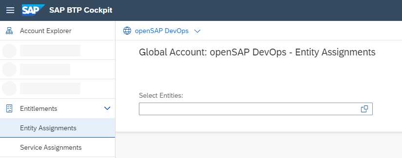
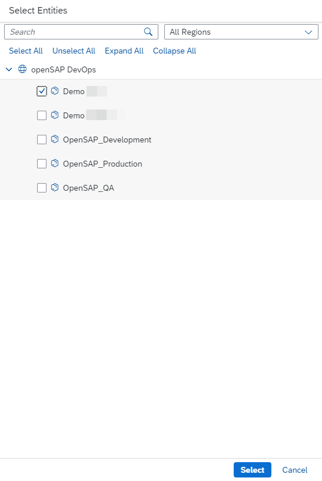
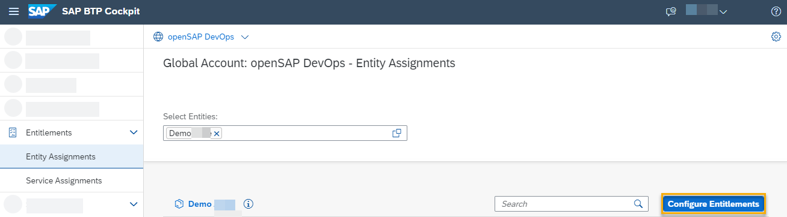
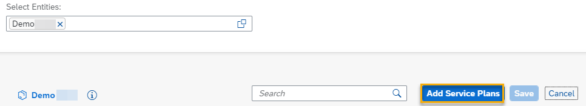
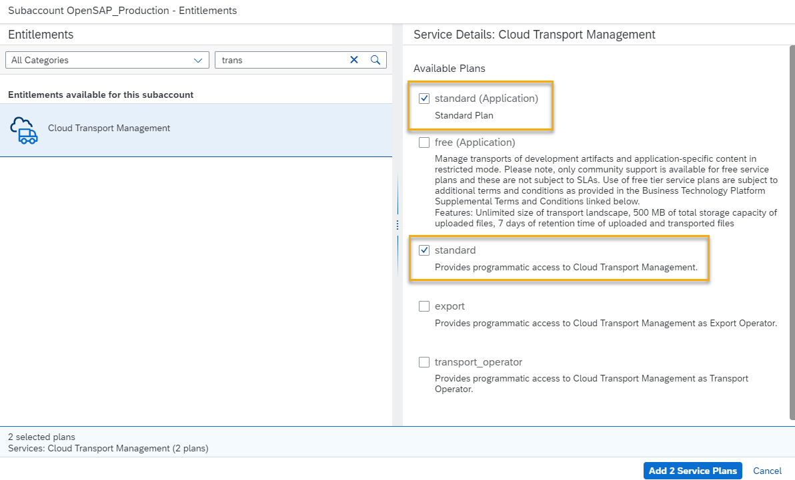
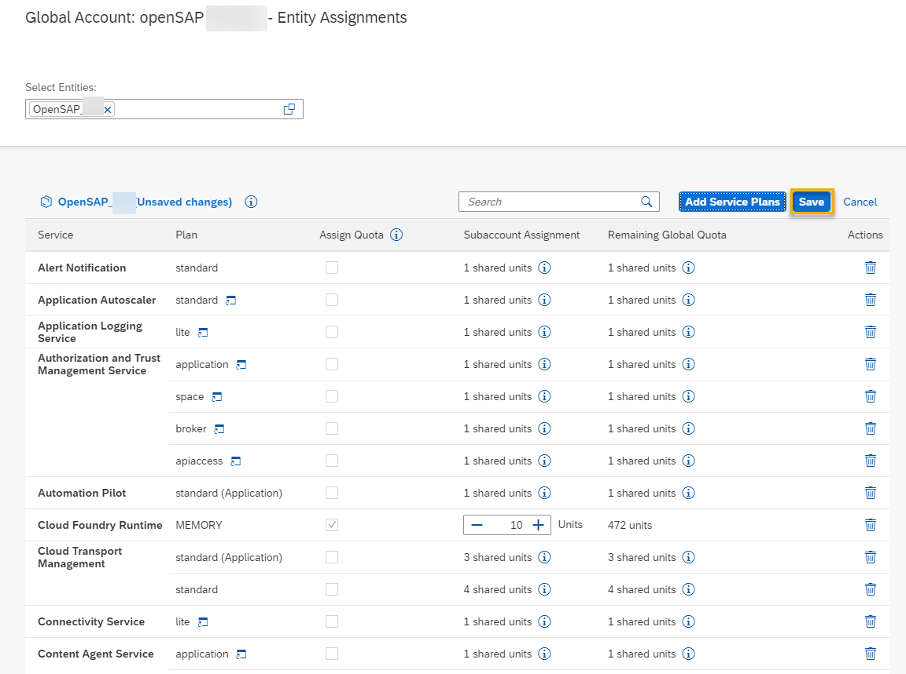

<!-- loio13894bed9e2d4b25aa34d03d002707f9 -->

# Configuring Entitlements to SAP Cloud Transport Management

To define access of your subaccount to SAP Cloud Transport Management service, assign entitlements for the subaccount in which you want to use the service.

> ### Note:  
> If you are using this service as part of a service from the SAP Build ecosystem, follow the instructions in the [Initial Setup of SAP Build](https://help.sap.com/docs/SAP_BUILD/411a94a7191243e0a99c9af3a061cee9/43c81b7e3b9749329fa8595b22680b82.html) documentation instead.

<table>
<tr>
<th valign="top">

Step

</th>
<th valign="top">

Action

</th>
<th valign="top">

More Information

</th>
</tr>
<tr>
<td valign="top">

1.

</td>
<td valign="top">

Navigate to the subaccount, in which you want to use SAP Cloud Transport Management, or create a new one.

> ### Recommendation:  
> Run SAP Cloud Transport Management service as shared service, by setting it up on a central administrative subaccount, to facilitate role management and allow strict access control.

> ### Note:  
> If you're integrating SAP Cloud Transport Management with SAP Cloud ALM, don't use the SAP Cloud ALM subaccount.

> ### Note:  
> If you're configuring entitlements in a subaccount that resides in the path of a directory that is configured to manage entitlements, you must add the service plan first to the managed directory.

</td>
<td valign="top">

[Create a Subaccount](https://help.sap.com/docs/BTP/65de2977205c403bbc107264b8eccf4b/05280a123d3044ae97457a25b3013918.html) 

</td>
</tr>
<tr>
<td valign="top">

2.

</td>
<td valign="top">

In your subaccount, create a Cloud Foundry org.

1.  In the *Cloud Foundry* section, choose *Enable Cloud Foundry*.
2.  Enter a name for your organization \(org\) and choose *Create*.

</td>
<td valign="top">

[Managing Orgs](https://help.sap.com/docs/BTP/65de2977205c403bbc107264b8eccf4b/fe1ebf3cd6fe46798efcaf45c73a54ce.html) 

</td>
</tr>
<tr>
<td valign="top">

3.

</td>
<td valign="top">

Assign entitlements to SAP Cloud Transport Management for your subaccount. To do this, in your global account or subaccount, choose *Entitlements* \> *Entity Assignments*.

</td>
<td valign="top" rowspan="5">

[Configure Entitlements and Quotas for Subaccounts](https://help.sap.com/docs/BTP/65de2977205c403bbc107264b8eccf4b/5ba357b4fa1e4de4b9fcc4ae771609da.html) 

</td>
</tr>
<tr>
<td valign="top">

4.

</td>
<td valign="top">

Enter your subaccount name in the search field, or select it from the list, and choose *Select*.

</td>
</tr>
<tr>
<td valign="top">

5.

</td>
<td valign="top">

Choose *Configure Entitlements* for the selected subaccount.

</td>
</tr>
<tr>
<td valign="top">

6.

</td>
<td valign="top">

Choose *Add Service Plans*.

</td>
</tr>
<tr>
<td valign="top">

7.

</td>
<td valign="top">

In the *Entitlements* section, search for *Cloud Transport Management*, and select it.

</td>
</tr>
<tr>
<td valign="top">

8.

</td>
<td valign="top">

In the *Service Details*, the available service plans are displayed.

The displayed plans depend on what was previously assigned to your global account.

Select an application plan for access to the user interface of SAP Cloud Transport Management. For programmatic access to SAP Cloud Transport Management, select an instance plan.

> ### Note:  
> If you plan to create several service instances with different access rights, you can also assign more than one instance plan.

</td>
<td valign="top">

For more information about the service plans available for SAP Cloud Transport Management, see [Service Plans and Metering](../service-plans-and-metering-17c102d.md).

</td>
</tr>
<tr>
<td valign="top">

9.

</td>
<td valign="top">

Choose *Add *<number\>* Service Plans*.

</td>
<td valign="top" rowspan="2">

[Configure Entitlements and Quotas for Subaccounts](https://help.sap.com/docs/BTP/65de2977205c403bbc107264b8eccf4b/5ba357b4fa1e4de4b9fcc4ae771609da.html) 

</td>
</tr>
<tr>
<td valign="top">

10.

</td>
<td valign="top">

To save the entitlements, choose *Save*.

</td>
</tr>
</table>

The service plans for SAP Cloud Transport Management are assigned to your subaccount.

