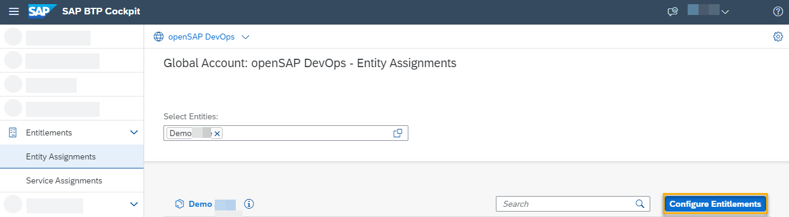

<!-- loio13894bed9e2d4b25aa34d03d002707f9 -->

# Configuring Entitlements to SAP Cloud Transport Management

To define access of your subaccount to SAP Cloud Transport Management service, assign entitlements for the subaccount in which you want to use the service.

> ### Note:  
> If you are using this service as part of SAP Build Code, follow the [SAP Build Code Initial Setup](https://help.sap.com/docs/build_code/d0d8f5bfc3d640478854e6f4e7c7584a/07698d7c31284e4db370acdf017cfd14.html?version=SHIP) instructions instead.

<table>
<tr>
<th valign="top">

Step

</th>
<th valign="top">

Action

</th>
<th valign="top">

More Information

</th>
</tr>
<tr>
<td valign="top">

1.

</td>
<td valign="top">

In your global account, choose an existing multi-environment subaccount, in which you want to use SAP Cloud Transport Management, or create a new one.

> ### Recommendation:  
> Run SAP Cloud Transport Management service as shared service, by setting it up on a central administrative subaccount, to facilitate role management and allow strict access control.

</td>
<td valign="top">

[Create a Subaccount](https://help.sap.com/docs/BTP/65de2977205c403bbc107264b8eccf4b/05280a123d3044ae97457a25b3013918.html) 

</td>
</tr>
<tr>
<td valign="top">

2.

</td>
<td valign="top">

In your subaccount, create a Cloud Foundry org.

1.  In the *Cloud Foundry* section, choose *Enable Cloud Foundry*.
2.  Enter a name for your organization \(org\) and choose *Create*.

</td>
<td valign="top">

[Managing Orgs](https://help.sap.com/docs/BTP/65de2977205c403bbc107264b8eccf4b/fe1ebf3cd6fe46798efcaf45c73a54ce.html) 

</td>
</tr>
<tr>
<td valign="top">

3.

</td>
<td valign="top">

Assign entitlements to SAP Cloud Transport Management for your subaccount. To do this, in your global account or subaccount, choose *Entitlements* \> *Entity Assignments*.

</td>
<td valign="top" rowspan="5">

[Configure Entitlements and Quotas for Subaccounts](https://help.sap.com/docs/BTP/65de2977205c403bbc107264b8eccf4b/5ba357b4fa1e4de4b9fcc4ae771609da.html) 

</td>
</tr>
<tr>
<td valign="top">

4.

</td>
<td valign="top">

Enter your subaccount name in the search field, or select it from the list, and choose *Select*.

</td>
</tr>
<tr>
<td valign="top">

5.

</td>
<td valign="top">

Choose *Configure Entitlements* for the selected subaccount.

</td>
</tr>
<tr>
<td valign="top">

6.

</td>
<td valign="top">

Choose *Add Service Plans*.

</td>
</tr>
<tr>
<td valign="top">

7.

</td>
<td valign="top">

In the *Entitlements* section, search for *Cloud Transport Management*, and select it.

</td>
</tr>
<tr>
<td valign="top">

8.

</td>
<td valign="top">

In the *Service Details*, the available service plans are displayed.

The displayed plans depend on what was previously assigned to your global account.

SAP Cloud Transport Management service offers the following plans:

**Application Plans**

<table>
<tr>
<th valign="top">

Application Plan Name

</th>
<th valign="top">

Use Case

</th>
</tr>
<tr>
<td valign="top">

*build-code \(Application\)*

</td>
<td valign="top">

Plan to be used, if you are using the user interface of SAP Cloud Transport Management as part of SAP Build Code.

</td>
</tr>
<tr>
<td valign="top">

*free \(Application\)*

</td>
<td valign="top">

Plan to access the user interface of SAP Cloud Transport Management with a reduced scope for testing purposes.

</td>
</tr>
<tr>
<td valign="top">

*standard \(Application\)*

</td>
<td valign="top">

Default plan to access the user interface of SAP Cloud Transport Management.

</td>
</tr>
</table>

For more information, see [SAP Discovery Center - SAP Cloud Transport Management](https://discovery-center.cloud.sap/serviceCatalog/cloud-transport-management/?region=all&tab=service_plan).

<table>
<tr>
<th valign="top">

Instance Plan

</th>
<th valign="top">

Description

</th>
</tr>
<tr>
<td valign="top">

*standard*

</td>
<td valign="top">

Default plan to access SAP Cloud Transport Management using programmatic access.

This plan provides full access to the Cloud Transport Management API.

Use this service plan for the integration with Change Request Management of SAP Solution Manager.

</td>
</tr>
<tr>
<td valign="top">

*export*

</td>
<td valign="top">

Plan to access SAP Cloud Transport Management using programmatic access with reduced authorizations for export actions only. This plan allows file upload and node upload/export actions.

Use this service plan to restrict access to SAP Cloud Transport Management, if enhanced security requirements are required. Use it, for example for the integration with SAP Solution Lifecycle Management service or CI/CD pipelines.

</td>
</tr>
<tr>
<td valign="top">

*transport\_operator*

</td>
<td valign="top">

Plan to access SAP Cloud Transport Management using programmatic access with reduced authorizations for transport operator actions only. This plan allows import, reset, forward, and delete actions.

Use this service plan to restrict access to SAP Cloud Transport Management, if enhanced security requirements are required.

</td>
</tr>
</table>

Select the following plans:

-   *Transport of Content Archives that are available on Local File Systems* scenario:

    For access to the user interface of SAP Cloud Transport Management, select an application plan, for example, *standard \(Application\)*.

-   *Transport of Content Archives directly in another Application* scenario:

    1.  For access to the user interface of SAP Cloud Transport Management, select an application plan, for example, *standard \(Application\)*.

    2.  For programmatic access to SAP Cloud Transport Management, select one of the instance plans, for example, *standard*.

        > ### Note:  
        > If you plan to create several service instances with different access rights, you can also assign more than one instance plan.

</td>
<td valign="top">

For more information about the instance plans with reduced authorizations available for SAP Cloud Transport Management, see the section *Service Plans with Specific Authorizations* in the topic [Security](../60-security/security-51939a4.md).

</td>
</tr>
<tr>
<td valign="top">

9.

</td>
<td valign="top">

Choose *Add *<number\>* Service Plans*.

</td>
<td valign="top" rowspan="2">

[Configure Entitlements and Quotas for Subaccounts](https://help.sap.com/docs/BTP/65de2977205c403bbc107264b8eccf4b/5ba357b4fa1e4de4b9fcc4ae771609da.html) 

</td>
</tr>
<tr>
<td valign="top">

10.

</td>
<td valign="top">

To save the entitlements, choose *Save*.

</td>
</tr>
</table>

The service plans for SAP Cloud Transport Management are assigned to your subaccount.

