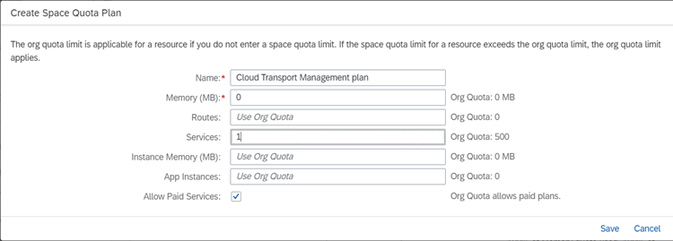
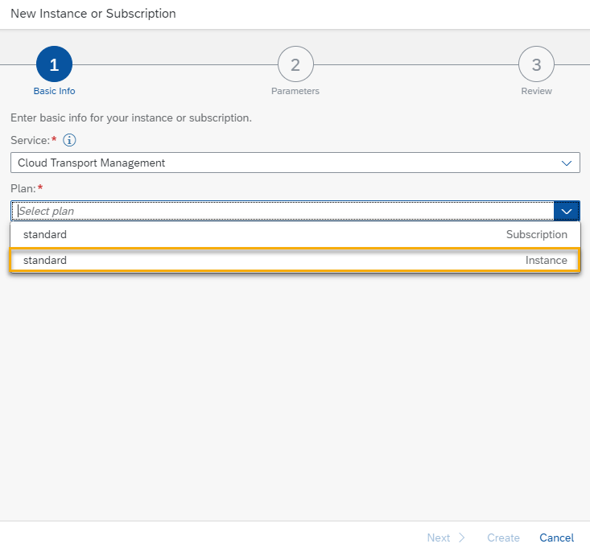
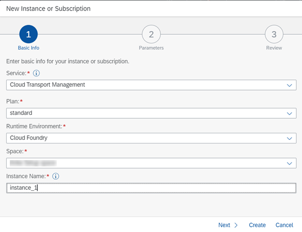

<!-- loiof44956035ce54684b1dbb9e4d23c37d2 -->

<link rel="stylesheet" type="text/css" href="../css/sap-icons.css"/>

# Creating a Service Instance and a Service Key

Follow these steps to enable the usage of SAP Cloud Transport Management service using programmatic access \(using API Remote Call\).

Create a service instance in the Cloud Foundry environment. You can then create a service key to communicate directly with the service instance.

> ### Note:  
> If you use the integration of SAP Cloud Transport Management in SAP Cloud ALM, proceed as described in the [SAP Cloud Transport Management](https://help.sap.com/docs/CloudALM/08879d094f3b4de3ac67832f4a56a6de/730ae36cc6ca419aae747012015cc686.html) topic of the SAP Cloud ALM documentation.


<table>
<tr>
<th valign="top">

Step

</th>
<th valign="top">

Action

</th>
<th valign="top">

More Information

</th>
</tr>
<tr>
<td valign="top">

1.

</td>
<td valign="top">

In the Cloud Foundry organization, create a space and assign the space roles to your user.

1.  On the *Overview* page of your subaccount, in the Cloud Foundry org, you have a *Spaces* table. Choose *Create Space*.
2.  Choose a name and leave the default space roles selected.
3.  Choose *Create*.


</td>
<td valign="top">

[Create Spaces](https://help.sap.com/docs/BTP/65de2977205c403bbc107264b8eccf4b/2f6ed22ccf424dae84345f4500c2d8ea.html) 

</td>
</tr>
<tr>
<td valign="top">

2.

</td>
<td valign="top">

Optional: If you want to limit the resource usage of your space, create a quota plan for the space.

1.  In your subaccount, choose *Cloud Foundry* \> *Quota Plans* \> *New Plan*.
2.  Enter a name, and at least `1` service that you want to use for the SAP Cloud Transport Management instance. Choose *Save*.

    

3.  To assign the quota plan to your space, under *Plan Assignment*, choose the quota plan from the dropdown list of the created space.


</td>
<td valign="top">

[Assign Quota Plans to Spaces](https://help.sap.com/docs/BTP/65de2977205c403bbc107264b8eccf4b/13028c44698e4a1a919fd5f96e9c28a5.html) 

</td>
</tr>
<tr>
<td valign="top">

3.

</td>
<td valign="top">

In the space, create a service instance of SAP Cloud Transport Management.

1.  In your subaccount, choose *Services* \> *Instances and Subscriptions*.
2.  Choose *Create*.
3.  In the wizard, select the following values:


    <table>
    <tr>
    <th valign="top">

    Field
    
    </th>
    <th valign="top">

    Value
    
    </th>
    </tr>
    <tr>
    <td valign="top">
    
    *Service*
    
    </td>
    <td valign="top">
    
    Select *Cloud Transport Management*.
    
    </td>
    </tr>
    <tr>
    <td valign="top">
    
    *Plan*
    
    </td>
    <td valign="top">
    
    Select one of the available plans of type *Instance* that are displayed depending on the entitlements that you previously added to the subaccount. For more information, see [Configuring Entitlements to SAP Cloud Transport Management](configuring-entitlements-to-sap-cloud-transport-management-13894be.md).

    > ### Note:  
    > Make sure that you select the plan of type *Instance*. After you've selected the plan, you no longer see *Instance*. Only *standard* is displayed in the *Plan* field.


    
    </td>
    </tr>
    </table>
    
    In the following screenshot, the *standard* plan of type *Instance* is selected.

    

4.  The following fields are now available for input. Select or enter values for them.


    <table>
    <tr>
    <th valign="top">

    Field
    
    </th>
    <th valign="top">

    Value
    
    </th>
    </tr>
    <tr>
    <td valign="top">
    
    *Runtime Environment*
    
    </td>
    <td valign="top">
    
    Select *Cloud Foundry*.
    
    </td>
    </tr>
    <tr>
    <td valign="top">
    
    *Space*
    
    </td>
    <td valign="top">
    
    Select the space that you created previously \(in Step 1\).
    
    </td>
    </tr>
    <tr>
    <td valign="top">
    
    *Instance Name*
    
    </td>
    <td valign="top">
    
    Enter a name for the new service instance.
    
    </td>
    </tr>
    </table>
    
    The following screenshot provides sample values.

    

5.  Choose *Create*.
6.  If you've added entitlements for multiple service instances, repeat the steps for the additional instances.


</td>
<td valign="top">

[Creating Service Instances In Cloud Foundry](https://help.sap.com/docs/SERVICEMANAGEMENT/09cc82baadc542a688176dce601398de/6d6846def3c443aa9f83d127353147ce.html) 

</td>
</tr>
<tr>
<td valign="top">

4.

</td>
<td valign="top">

Create a service key based on the service instance for SAP Cloud Transport Management.

1.  In your subaccount, choose *Services* \> *Instances and Subscriptions*.
2.  On the *Instances* tab, in the row of the instance that you created, select the <span class="SAP-icons-V5"></span> \(Actions\) menu, and choose *Create Service Key*.
3.  Enter a name for the service key, and choose *Create*.

    The service key has the following format:

    > ### Output Code:  
    > ```
    > {
    >     "uaa": {
    >         "clientid": "sb-xxxxxx",
    >         "clientsecret": "xxxxxx",
    >         "url": "https://<domain>.authentication.sap.hana.ondemand.com",
    >         ...
    > 
    >     },
    >     "uri": "https://transport-service-app-backend.ts.cfapps.sap.hana.ondemand.com"
    > }
    > 
    > ```


> ### Note:  
> The connection details are used later to configure destinations in your cloud subaccount to SAP Cloud Transport Management.

For more information about how to configure the destinations, see [Create Destinations to SAP Cloud Transport Management Service](../20-configure-landscape/create-destinations-to-sap-cloud-transport-management-service-795f733.md#loio795f7337e5d943df98c961303b02678b).

</td>
<td valign="top">

[Creating Service Keys in Cloud Foundry](https://help.sap.com/docs/SERVICEMANAGEMENT/09cc82baadc542a688176dce601398de/6fcac08409db4b0f9ad55a6acd4d31c5.html) 

</td>
</tr>
</table>

You can now configure the landscape and use SAP Cloud Transport Management directly in other applications, such as SAP Cloud Integration. For more information, see [Configuring the Landscape](../20-configure-landscape/configuring-the-landscape-3e7b042.md).

