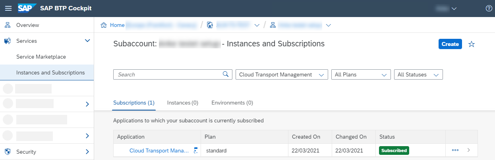
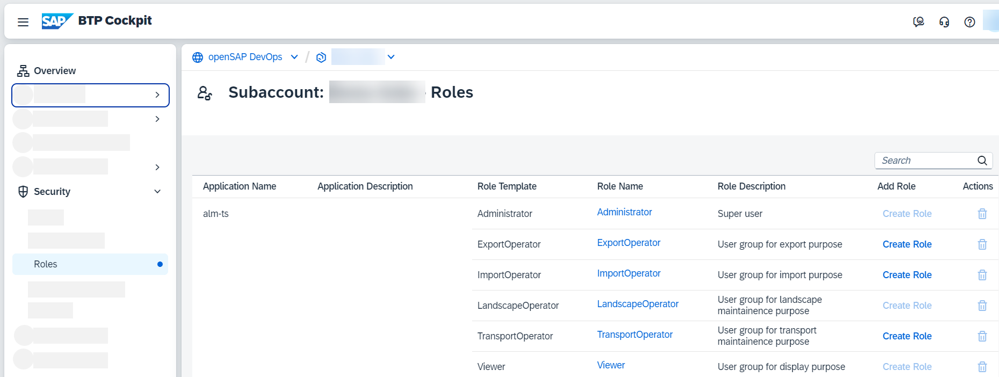
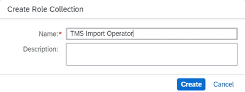

<!-- loioeb134e02d2074918bcc5af34f50fb19f -->

<link rel="stylesheet" type="text/css" href="../css/sap-icons.css"/>

# Setting Up Role Collections

To configure user access and permissions, set up role collections for the different roles available for SAP Cloud Transport Management.

After successful subscription, you need to configure user access to the application. You create different role collections for the different SAP Cloud Transport Management roles, and assign roles to the role collections based on the application templates. Afterwards, you assign the role collections to users or user groups.

For the *LandscapeOperator* and the *Viewer* roles, SAP Cloud Transport Management delivers the *TMS\_LandscapeOperator\_RC* and *TMS\_Viewer\_RC* role collections. You don´t need to set up role collections for these two roles.

> ### Note:  
> It's possible to create new role collections and add the roles to the new role collections directly after creating the collections, which would prevent you from having to switch between different views in SAP BTP cockpit. However, we recommend that you add the roles in the *Roles* tab of the **subscription details**. This is useful, because all template roles relevant for the service are displayed there.
> 
> The following steps describe the recommended procedure.

<table>
<tr>
<th valign="top">

Step

</th>
<th valign="top">

Action

</th>
<th valign="top">

More Information

</th>
</tr>
<tr>
<td valign="top">

1.

</td>
<td valign="top">

You find the roles delivered for the service in the subscription details on the *Roles* tab.

1.  To get there, in your subaccount, choose *Services* \> *Instances and Subscriptions*.

    

2.  On the *Subscriptions* tab, in the *Cloud Transport Management* row, choose  \(Actions\) and *Manage Roles*.

    

3.  The default role templates are displayed.

    

    > ### Note:  
    > If you've opened the *Roles* view of your subaccount by choosing *Security* \> *Roles*, you see the role templates available for the `alm-ts` application, which is relevant for the user interface of SAP Cloud Transport Management. 
    > 
    > Even though you can set up the role collections in this view, we don't recommend to do this as described previously.
    > 
    > Depending on your entitlements, for example the role templates of the `alm-ts-backend` or `alm-ts-dev` applications can also be displayed. It's **not** necessary to add roles to these applications, because access is enabled using service instances, and the role assignment implicitly happens through the selected instance plan. For more information, see *Step 3.3* in the topic [Creating a Service Instance and a Service Key](creating-a-service-instance-and-a-service-key-f449560.md).

</td>
<td valign="top">

For more information on the SAP Cloud Transport Management roles, see [Security](../60-security/security-51939a4.md).

</td>
</tr>
<tr>
<td valign="top">

2.

</td>
<td valign="top">

Create different role collections for the required SAP Cloud Transport Management roles.

1.  To create a new role collection, in your subaccount, choose *Security* \> *Role Collections*.
2.  Choose *Create*.

    

3.  Enter a name for the new role collection, and choose *Create*.

    

    The new role collection is added to the list.

    

4.  Repeat the previous steps to create different role collections for different SAP Cloud Transport Management roles.

    For example, you can create a role collection for administration tasks that contains the *Administrator* role, and a role collection for developers with *ExportOperator* role.

</td>
<td valign="top">

[Working with Role Collections](https://help.sap.com/docs/BTP/65de2977205c403bbc107264b8eccf4b/393ea0b222754311884123ce564779bd.html) 

</td>
</tr>
<tr>
<td valign="top">

3.

</td>
<td valign="top">

Assign the different SAP Cloud Transport Management roles to the role collections.

1.  In your subaccount, choose *Services* \> *Instances and Subscriptions*.

2.  On the *Subscriptions* tab, in the *Cloud Transport Management* row, choose  \(Actions\) and *Manage Roles*.
3.  Go to the *Roles* tab of the subscription details.
4.  In the row of the template role that you want to add to the role collection, choose :heavy_plus_sign:.

    

5.  Select the role collection to which you want to add the role, and choose *Add*.

    

    The role was added to the role collection.

    

6.  Repeat the previous steps for all role collections that you've created.

You can create additional roles and add them to role collections, for example, to restrict the authorizations to specific transport nodes only. For more information, see [Security](../60-security/security-51939a4.md) under *Node-Specific Attributes*.

</td>
<td valign="top">

 

</td>
</tr>
<tr>
<td valign="top">

4.

</td>
<td valign="top">

After you've created the role collections and assigned roles to them, assign the role collections to users or user groups.

1.  To do this, choose *Security* \> *Role Collections*.
2.  Select the required role collection.
3.  Choose *Edit*.
4.  In the *Users* tab, select your identity provider and enter the user data as required by your identity provider.

</td>
<td valign="top">

[Assign Users to Role Collections](https://help.sap.com/docs/BTP/65de2977205c403bbc107264b8eccf4b/c5766765bda74ad59fe656977c8fa4d6.html) 

</td>
</tr>
</table>

