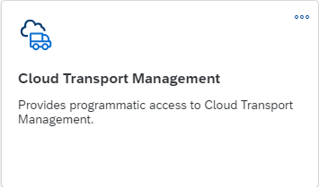
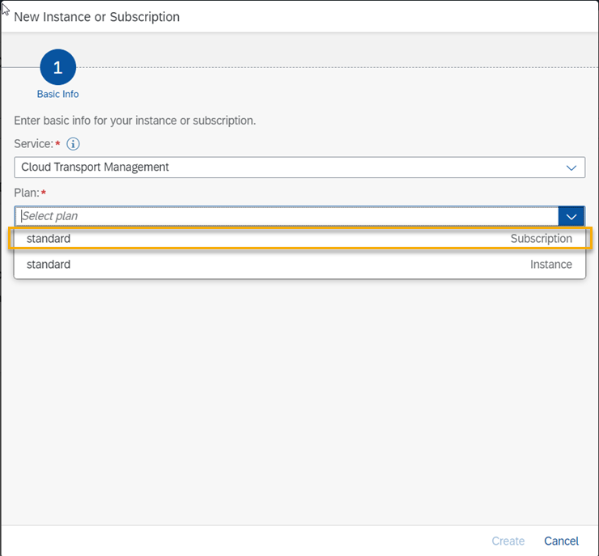
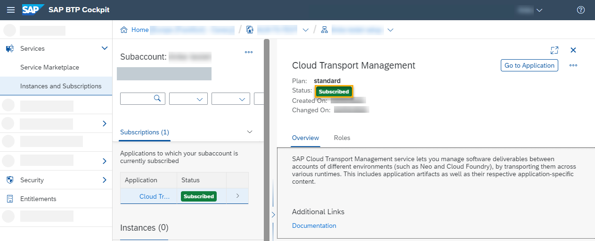

<!-- loio7fe10fc1baae444e9315579786d623b9 -->

<link rel="stylesheet" type="text/css" href="../css/sap-icons.css"/>

# Subscribing to Cloud Transport Management

To enable the usage of the user interface of SAP Cloud Transport Management service, subscribe to the Cloud Transport Management application.

> ### Note:  
> If you are using this service as part of SAP Build Code, follow the [SAP Build Code Initial Setup](https://help.sap.com/docs/build_code/d0d8f5bfc3d640478854e6f4e7c7584a/07698d7c31284e4db370acdf017cfd14.html?version=SHIP) instructions instead.

<a name="loio7fe10fc1baae444e9315579786d623b9__section_fry_gwd_4yb"/>

## Prerequisites

You've configured an entitlement for the Cloud Transport Management application. For more information, see [Configuring Entitlements to SAP Cloud Transport Management](configuring-entitlements-to-sap-cloud-transport-management-13894be.md).

<a name="loio7fe10fc1baae444e9315579786d623b9__section_wsj_2yp_3tb"/>

## Procedure

To subscribe to SAP Cloud Transport Management, follow these steps:

<table>
<tr>
<th valign="top">

Step

</th>
<th valign="top">

Action

</th>
<th valign="top">

More Information

</th>
</tr>
<tr>
<td valign="top">

1.

</td>
<td valign="top">

In the subaccount, in which you want to use SAP Cloud Transport Management, choose *Services* \> *Service Marketplace*.

> ### Recommendation:  
> Run SAP Cloud Transport Management service as shared service, by setting it up on a central administrative subaccount, to facilitate role management and allow strict access control.

The entitled subscriptions are shown.

</td>
<td valign="top" rowspan="6">

[Subscribe to Multitenant Applications Using the Cockpit](https://help.sap.com/docs/BTP/65de2977205c403bbc107264b8eccf4b/7a3e39622be14413b2a4df7c02ca1170.html) 

</td>
</tr>
<tr>
<td valign="top">

2.

</td>
<td valign="top">

Search for *Cloud Transport Management*.

</td>
</tr>
<tr>
<td valign="top">

3.

</td>
<td valign="top">

On the *Cloud Transport Management* tile, choose  \(Actions\) and *Create*.

> ### Note:  
> If you haven't selected an instance plan when configuring the entitlements, a different Cloud Transport Management tile with a different text is displayed.

</td>
</tr>
<tr>
<td valign="top">

4.

</td>
<td valign="top">

In the subsequent dialog, from the *Plan* dropdown box, select one of the available plans of type *Subscription* that are displayed depending on the entitlements that you previously added to the subaccount. In the screenshot, this is the *standard* plan. Once you've selected the plan, you no longer see *Subscription* displayed in the *Plan* field, only the name of the selected plan, here *standard*. Afterwards, choose *Create*.

> ### Note:  
> Make sure that you select a plan of type *Subscription*.
> 
> Depending on your entitlement, this can be one of the following:
> 
> -   *build-code* \(Use this plan, if you are using SAP Cloud Transport Management as part of SAP Build Code.\)
> -   *free*
> -   *standard*

</td>
</tr>
<tr>
<td valign="top">

5.

</td>
<td valign="top">

A dialog box shows that the subscription is in progress. Choose *View Subscription*.

</td>
</tr>
<tr>
<td valign="top">

6.

</td>
<td valign="top">

The status *Subscribed* shows that the subscription is activated.

</td>
</tr>
</table>

The *Go to Application* link allows you to start the user interface of SAP Cloud Transport Management. You can log on with your e-mail address and password as usual.

However, before you can use it, you'll need to set up role collections and assign roles and permissions to your user.

> ### Note:  
> You can always check your subscriptions under *Services* \> *Instances and Subsriptions*.

> ### Tip:  
> To update from an existing subscription plan to another plan, see [Updating the Service Plan](../50-administration/updating-the-service-plan-1717e87.md).

