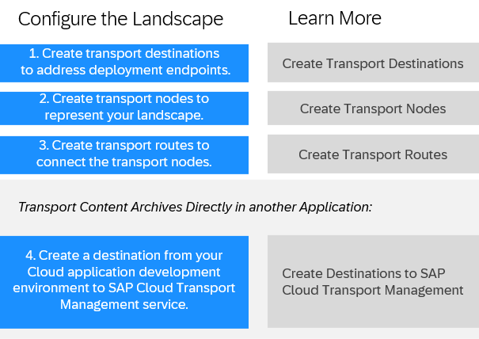

<!-- loio3e7b04236d804a4eb80e42c6360209f1 -->

# Configuring the Landscape

Before you can use SAP Cloud Transport Management service to transport cloud applications or application content \(such as SAP Cloud Integration content, for example\) between different environments, you must configure your landscape for transports.

The configuration involves the following steps:

-   **[SAP Cloud Transport Management Scenarios](sap-cloud-transport-management-scenarios-0cb16e5.md "You can use SAP Cloud Transport Management to transport content archives directly from within an
		application's source environment to a target environment. If there's no export integration of SAP Cloud Transport Management in the source environment, you can use the service to upload content archives from
		a local file system and import them in a target environment.")**  
You can use SAP Cloud Transport Management to transport content archives directly from within an application's source environment to a target environment. If there's no export integration of SAP Cloud Transport Management in the source environment, you can use the service to upload content archives from a local file system and import them in a target environment.
-   **[Create Transport Destinations](create-transport-destinations-c9905c1.md "In SAP Cloud Transport Management service, transport destinations are used to address the target end
		point of a deployment process. ")**  
In SAP Cloud Transport Management service, transport destinations are used to address the target end point of a deployment process.
-   **[Create Transport Nodes](create-transport-nodes-f71a4d5.md "Create transport nodes as representations of the source and target end points of
		deployment processes in your landscape. Add configuration details as required. ")**  
Create transport nodes as representations of the source and target end points of deployment processes in your landscape. Add configuration details as required.
-   **[Create Transport Routes](create-transport-routes-dddb749.md "In SAP Cloud Transport Management, transport routes
		are used to connect transport nodes.")**  
In SAP Cloud Transport Management, transport routes are used to connect transport nodes.
-   **[Use the Transport Landscape Wizard](use-the-transport-landscape-wizard-f14192e.md "You can use the Transport Landscape Wizard to configure the transport nodes and
		transport routes of simple transport landscapes.")**  
You can use the Transport Landscape Wizard to configure the transport nodes and transport routes of simple transport landscapes.
-   **[Create Destinations to SAP Cloud Transport Management Service](create-destinations-to-sap-cloud-transport-management-service-795f733.md#loio795f7337e5d943df98c961303b02678b "If you use SAP Cloud Transport Management service to
		start the transport directly in your application, a destination to SAP Cloud Transport Management service is required in the source
		(development) environment of your application.")**  
If you use SAP Cloud Transport Management service to start the transport directly in your application, a destination to SAP Cloud Transport Management service is required in the source \(development\) environment of your application.

