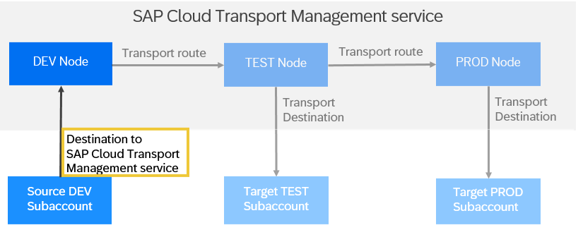

<!-- loio795f7337e5d943df98c961303b02678b -->

# Create Destinations to SAP Cloud Transport Management Service

If you use SAP Cloud Transport Management service to start the transport directly in your application, a destination to SAP Cloud Transport Management service is required in the source \(development\) environment of your application.

<a name="loio795f7337e5d943df98c961303b02678b__prereq_dk1_hnt_q1c"/>

## Prerequisites

-   You want to start the transport directly in your application.
-   To create the destination to SAP Cloud Transport Management, you have the following information:
    -   You know the fixed name of the destination.

        The destination has a fixed name, for example `TransportManagementService` for SAP Cloud Integration, or `ctms_destination` for SAP Build Work Zone, standard edition.

    -   You know from which service key you retrieve the connection details.

        In general, you retrieve the required connection details from the service key of the SAP Cloud Transport Management instance that is used for the transport. For more information about how to create the service instance and a service key for SAP Cloud Transport Management, see [Creating a Service Instance and a Service Key](../10-initial-setup/creating-a-service-instance-and-a-service-key-f449560.md).

## Context

Destinations contain the connection details for the remote communication of an application.

In the source environment of your application, create a destination to SAP Cloud Transport Management to address the export API of SAP Cloud Transport Management. This destination contains the connection details to SAP Cloud Transport Management service, such as the address of the SAP Cloud Transport Management instance that will be used for the transport as well as authentication details. You retrieve the connection details from the service key of the SAP Cloud Transport Management instance used for the transport.

> ### Recommendation:  
> We recommend that you refer to the documentation of your application for details about how to configure the destination to SAP Cloud Transport Management.
> 
> -   For links to documentation of known integrations into SAP Cloud Transport Management, see [Integration in Development and Change Management Processes and with Other Services](../70-integrations/integrating-the-service-7e966f7.md#loioddaa000bc92c43d8bd09f4e2c8ca05eb).
> -   An overview of known content that is supported by SAP Cloud Transport Management is listed under [Overview: Supported Content](../supported-content-types-8961dcb.md#loio0dccbb6ee1714240b9b9bedc1a240a7e).

<a name="loio795f7337e5d943df98c961303b02678b__steps-unordered_jjz_k55_q1c"/>

## Procedure

-   SAP BTP, Cloud Foundry Environment

    The specific details for your application may depend on different criteria, such as the following:

    -   Is SAP Content Agent service used to export the content into `.mtar` files before handing them over to SAP Cloud Transport Management?

        For SAP Cloud Integration content, see [Enabling Content Transport, Cloud Foundry Enviroment](https://help.sap.com/docs/CLOUD_INTEGRATION/368c481cd6954bdfa5d0435479fd4eaf/452c677debfc4fda904310560ab03743.html?locale=en-US).

    -   Does your application use the transport capabilities of SAP Cloud Application Lifecycle Management \(SAP Cloud ALM\) in combination with SAP Cloud Transport Management?

        In this case, you retrieve the connection details from the service key of the SAP Cloud ALM API instance instead of the service key of the SAP Cloud Transport Management instance.

    For more information, see the examples described in topic [Sample Configurations of Destinations to SAP Cloud Transport Management](create-destinations-to-sap-cloud-transport-management-service-795f733.md#loio75fe5d4b4fa3492c87ef6be32ea0b819).

-   SAP BTP, Neo Environment

    If your application runs in the SAP BTP, Neo environment, you define the destinations in the SAP Solution Lifecycle Management service.

    For more information about how to configure destinations in SAP BTP, Neo, see [Set Up Direct Uploads of MTA Archives Using the Transport Management Service](https://help.sap.com/docs/BTP/ea72206b834e4ace9cd834feed6c0e09/af84d67f4be24542ac5e46f613a99435.html?locale=en-US).

    For SAP Cloud Integration content, see also [Content Transport Using Transport Management Service](https://help.sap.com/viewer/368c481cd6954bdfa5d0435479fd4eaf/Cloud/en-US/d458b172b98d4112a08499541fddfc54.html?locale=en-US).

<a name="loio75fe5d4b4fa3492c87ef6be32ea0b819"/>

<!-- loio75fe5d4b4fa3492c87ef6be32ea0b819 -->

## Sample Configurations of Destinations to SAP Cloud Transport Management

The following are sample configurations of destinations to SAP Cloud Transport Management to transport SAP Cloud Integration content.

These examples serve as illustrations to help you better understand how to configure destinations to SAP Cloud Transport Management.

The examples cover the following use cases:

### Use Case 1: Transporting SAP Cloud Integration content in SAP BTP, Cloud Foundry environment using SAP Content Agent service to export integration content to `.mtar` files and handing them over to SAP Cloud Transport Management.

The destination contains the connection details to the SAP Cloud Transport Management instance to which SAP Content Agent service sends the exported SAP Cloud Integration content.

You retrieve the required connection details from the service key of the SAP Cloud Transport Management instance that is used for the transport.

### Use Case 2: Using SAP Cloud ALM to orchestrate the transport of SAP Cloud Integration content in SAP BTP, Cloud Foundry environment using SAP Content Agent service to export integration content to `.mtar` files and handing them over to SAP Cloud Transport Management.

You retrieve the required connection details from the service key of the SAP Cloud Transport Management instance that is used for the transport.

> ### Note:  
> Previously, when using SAP Cloud ALM, the destination to SAP Cloud Transport Management had to be configured containing the details of the SAP Cloud ALM API instance calling the SAP Cloud Transport Management instance. If you've configured the destination this way, you can continue to use it. However, if you start using SAP Cloud ALM with SAP Cloud Transport Management, configure it as described in the following sample.

For other content types, you can use the samples and adapt them to your use case.

<table>
<tr>
<th valign="top">

Field

</th>
<th valign="top">

Use Case 1: Destination to SAP Cloud Transport Management for SAP Cloud Integration using SAP Content Agent service 

</th>
<th valign="top">

Use Case 2: Destination to SAP Cloud Transport Management for SAP Cloud Integration using SAP Content Agent service with SAP Cloud ALM

</th>
<th valign="top">

Description

</th>
</tr>
<tr>
<td valign="top">

*Name*

</td>
<td valign="top">

`TransportManagementService` 

</td>
<td valign="top">

`CALM_FTR_CTMS_<meaningful suffix>`

> ### Example:  
> `CALM_FTR_CTMS_FEATURES` \(This value is case-sensitive.\)

</td>
<td valign="top">

Fixed name of the transport destination to SAP Cloud Transport Management.

</td>
</tr>
<tr>
<td valign="top">

*Type*

</td>
<td valign="top">

*HTTP* 

</td>
<td valign="top">

*HTTP* 

</td>
<td valign="top">

Destination type

</td>
</tr>
<tr>
<td valign="top">

*Description*

</td>
<td valign="top">

Description for your reference.

</td>
<td valign="top">

Description for your reference.

</td>
<td valign="top">

This field is optional.

</td>
</tr>
<tr>
<td valign="top">

*URL*

</td>
<td valign="top">

Value of `uri` from the service key of your SAP Cloud Transport Management service instance.

</td>
<td valign="top">

Value of `uri` from the service key of your SAP Cloud Transport Management service instance.

</td>
<td valign="top">

The URL is used to address the SAP Cloud Transport Management instance in the subaccount where it is required.

</td>
</tr>
<tr>
<td valign="top">

*Proxy Type*

</td>
<td valign="top">

*Internet* 

</td>
<td valign="top">

*Internet*

</td>
<td valign="top">

 

</td>
</tr>
<tr>
<td valign="top">

*Authentication* 

</td>
<td valign="top">

*OAuth2ClientCredentials* 

</td>
<td valign="top">

*OAuth2ClientCredentials*

</td>
<td valign="top">

 

</td>
</tr>
<tr>
<td valign="top">

*Client ID* 

</td>
<td valign="top">

Value of `clientid` \(`uaa` section\) from the service key of your SAP Cloud Transport Management service instance.

</td>
<td valign="top">

Value of `clientid` \(`uaa` section\) from the service key of your SAP Cloud Transport Management service instance.

</td>
<td valign="top" rowspan="4">

The details in these fields are required for user authentication and authorization.

The values of `clientid` and `clientsecret` in the `uaa` section basically represent the user used for the destination and the permissions of this user.

The URL in the `uaa` section addresses the authentication service of SAP BTP in the subaccount where SAP Cloud Transport Management is used.

The *Token Service URL* value is primarily used for authentication in the user authentication and authorization process. It routes to the authentication service of SAP Business Technology Platform \(SAP BTP\).

When the SAP BTP authentication service receives a request, it verifies the user and the subaccount information. If the verification succeeds, the service generates a token. This token is like a secret identifier that's used to authenticate subsequent requests from the client.

Once a token is generated, subsequent requests or API calls can be made without the need for re-authentication. Overall, the *Token Service URL* value enables secure communication, ensuring that only authenticated requests are processed.

</td>
</tr>
<tr>
<td valign="top">

*Client Secret* 

</td>
<td valign="top">

Value of `clientsecret` \(`uaa` section\) from the service key of your SAP Cloud Transport Management service instance.

</td>
<td valign="top">

Value of `clientsecret` \(`uaa` section\) from the service key of your SAP Cloud Transport Management service instance.

</td>
</tr>
<tr>
<td valign="top">

*Token Service URL Type* 

</td>
<td valign="top">

*Dedicated* 

</td>
<td valign="top">

*Dedicated* 

</td>
</tr>
<tr>
<td valign="top">

*Token Service URL* 

</td>
<td valign="top">

Value of `url` \(`uaa` section\) from the service key of your SAP Cloud Transport Management service instance.

Append `oauth/token` to the URL retrieved from the service key.

</td>
<td valign="top">

Value of `url` \(`uaa` section\) from the service key of your SAP Cloud Transport Management service instance.

Append `oauth/token` to the URL retrieved from the service key.

</td>
</tr>
<tr>
<td valign="top">

*Token Service User* 

</td>
<td valign="top">

No inputs required

</td>
<td valign="top">

No inputs required

</td>
<td valign="top">

 

</td>
</tr>
<tr>
<td valign="top">

*Token Service Password* 

</td>
<td valign="top">

No inputs required

</td>
<td valign="top">

No inputs required

</td>
<td valign="top">

 

</td>
</tr>
<tr>
<td valign="top">

*Additional Properties* 

</td>
<td valign="top">

1.  Choose *New Property*.

2.  As the key, enter `sourceSystemId` \(value is case-sensitive\).

3.  As the value, enter the name that you want to use as the source node of the transport route, for example, `DEV_NODE`.

    Reuse the value as the name of the source transport node later.

</td>
<td valign="top">

No inputs required

</td>
<td valign="top">

 

</td>
</tr>
<tr>
<td valign="top">

**More information**

</td>
<td valign="top">

Creating a service key for SAP Cloud Transport Management instance and configuring the destination:

-   SAP Cloud Integration documentation on SAP Help Portal: [Enabling Content Transport, Cloud Foundry Enviroment](https://help.sap.com/docs/CLOUD_INTEGRATION/368c481cd6954bdfa5d0435479fd4eaf/452c677debfc4fda904310560ab03743.html?locale=en-US)
-   SAP Content Agent service documentation on SAP Help Portal: [Create TransportManagementService Destination](https://help.sap.com/docs/CONTENT_AGENT_SERVICE/ae1a4f2d150d468d9ff56e13f9898e07/eed66f35f9d148c8ae5b2d46ff097d8c.html?locale=en-US)

</td>
<td valign="top">

Configuring the destination to SAP Cloud Transport Managementin SAP Cloud ALM:

-   SAP Cloud ALM documentation on SAP Help Portal: [Enabling Transport Management → SAP Cloud Transport Management Service](https://help.sap.com/docs/CloudALM/08879d094f3b4de3ac67832f4a56a6de/7d4c180c79744eb09c228007304a3a57.html?locale=en-US)
-   Blog Post in SAP Community: [New Integration of SAP Cloud Transport Management](https://community.sap.com/t5/technology-blogs-by-sap/new-integration-of-sap-cloud-transport-management-and-sap-cloud-alm/ba-p/13728049)

</td>
<td valign="top">

 

</td>
</tr>
</table>

