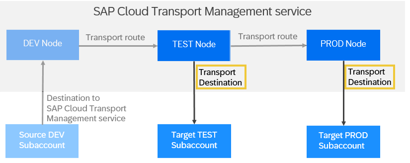

<!-- loioc9905c142cf14aea86fe2451434faed9 -->

# Create Transport Destinations

In SAP Cloud Transport Management service, transport destinations are used to address the target end point of a deployment process.

<a name="loioc9905c142cf14aea86fe2451434faed9__context_ykq_rzy_bdb"/>

## Context

Transport destinations contain the address of the **target** end point as well as an authentication type for access control, for example, the user credentials of the platform user that you want to use for the destination.

You create a transport destination in SAP BTP Cockpit of the subaccount in which you're subscribed to SAP Cloud Transport Management.

Note that SAP Cloud Transport Management only supports HTTPS destinations.

> ### Note:  
> For general information about how to configure destinations, refer to the following documentation:
> 
> -   SAP BTP, Cloud Foundry: [Using the Destinations Editor in the Cockpit](https://help.sap.com/docs/CP_CONNECTIVITY/cca91383641e40ffbe03bdc78f00f681/565fdb3dd19d4cda80864341dc5a0451.html?locale=en-US) 
> -   SAP BTP, Neo: [Configure Destinations from the Cockpit](https://help.sap.com/docs/CP_CONNECTIVITY/b865ed651e414196b39f8922db2122c7/60735ad11d8a488c83537cdcfb257135.html?locale=en-US)

-   **[Creating Destinations for MTA Deployment on Cloud Foundry](creating-destinations-for-mta-deployment-on-cloud-foundry-881d752.md "For MTA deployment on Cloud
                                Foundry, you have different options
		to configure transport destinations to address the target endpoint of the deployment process.")**  
For MTA deployment on Cloud Foundry, you have different options to configure transport destinations to address the target endpoint of the deployment process.
-   **[Creating Destinations for Deployment of References of SAP BTP, ABAP Environment](creating-destinations-for-deployment-of-references-of-sap-btp-abap-environment-3014453.md "To address the target end point of the deployment process of references of SAP BTP ABAP
                                    environment, create a destination to the target instance of SAP BTP ABAP
                                    environment where you want to deploy your content references.")**  
To address the target end point of the deployment process of references of SAP BTP ABAP environment, create a destination to the target instance of SAP BTP ABAP environment where you want to deploy your content references.
-   **[Creating Destinations for MTA Deployment on SAP BTP, Neo](creating-destinations-for-mta-deployment-on-sap-btp-neo-61306c6.md "To address the target end point of MTA deployment on SAP BTP, Neo,
		specify the URL to the SAP Solution Lifecycle Management
                                    service as the deploy end point of the
		destination.")**  
To address the target end point of MTA deployment on SAP BTP, Neo, specify the URL to the SAP Solution Lifecycle Management service as the deploy end point of the destination.
-   **[Creating Destinations for Deployment of Application Content Transported in an Application-Specific Format](creating-destinations-for-deployment-of-application-content-transported-in-an-application-23bb29c.md "To address the target end point of application-specific content deployment, specify a destination using the details from the provider of
		the application content. ")**  
To address the target end point of application-specific content deployment, specify a destination using the details from the provider of the application content.
-   **[Creating Destinations for XSC DU Deployment](creating-destinations-for-xsc-du-deployment-ddf120e.md "Specify https://host/sap/hana/xs/lm/slp/slp.xsjs as the deploy end point of the
		destination.")**  
Specify <code>https://<i class="varname">&lt;host&gt;</i>/sap/hana/xs/lm/slp/slp.xsjs</code> as the deploy end point of the destination.

