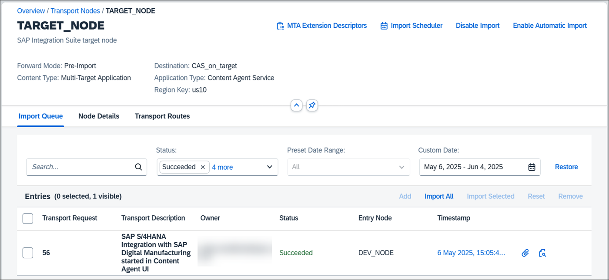

<!-- loio3c4b6f38866b4a70b20e79501db5f7e5 -->

# Using the Import Queue

In the import queue of a transport node, you can start the upload of a file or import processes.

<a name="loio3c4b6f38866b4a70b20e79501db5f7e5__context_cb1_csz_nfc"/>

## Context

The header section displays the name and the description of the transport node, and the information about the assigned *Forward Mode*, *Content Type*, and the *Destination*. Values for content type and destination exist only if the node has these entities assigned. If a destination is assigned, information about *Application Type* and *Region Key* are derived from it and are also displayed in the header section.

When you go to an import queue of a transport node, the *Import Queue* tab opens by default.

The following screenshot shows a sample import queue with one transport request that was successfully imported.

## Procedure

-   *Import Queue* tab

    This tab displays all transport requests that match the selected search and filter criteria. You can adjust the search and filter criteria to your requirements, and run different actions on the transport requests that are described in the subsequent topics.

-   *Node Details* tab

    This tab provides general information about the current transport node and details about import scheduling. Information about the forward mode, content type, and destination, if the node has a destination assigned, are still displayed in the header section.

-   *Transport Routes* tab

    The transport routes that are associated with the current transport node are displayed. When you select a transport node link, the transport routes of the selected node are displayed.

-   **[Prerequisites for Using the Import Queue](prerequisites-for-using-the-import-queue-dd661c7.md "To use the import queue, open it and have the appropriate authorizations.")**  
To use the import queue, open it and have the appropriate authorizations.
-   **[Search and Filter Options in an Import Queue](search-and-filter-options-in-an-import-queue-3228b4c.md "You have different options to search for transport requests in an import queue and filter for specific criteria.")**  
You have different options to search for transport requests in an import queue and filter for specific criteria.
-   **[Options to Display Information about Transport Requests](options-to-display-information-about-transport-requests-a90d808.md "For each transport request displayed in the import queue, you can display additional information.")**  
For each transport request displayed in the import queue, you can display additional information.
-   **[Add Files to Import Queues](add-files-to-import-queues-c3c87cb.md "By adding a file to the import queue, you upload it to the import queue and create a
		transport request.")**  
By adding a file to the import queue, you upload it to the import queue and create a transport request.
-   **[Import Transport Requests](import-transport-requests-d2005d5.md "SAP Cloud Transport Management allows you to flexibly
		manage the import of transport requests in transport nodes.")**  
SAP Cloud Transport Management allows you to flexibly manage the import of transport requests in transport nodes.
-   **[Forward Transport Requests](forward-transport-requests-630fae7.md "If the Forward Mode of a transport node is set to the value
			Manual, you can manually forward transport requests in this node
		to target transport nodes.")**  
If the *Forward Mode* of a transport node is set to the value *Manual*, you can manually forward transport requests in this node to target transport nodes.
-   **[Reset Transport Requests](reset-transport-requests-e56b4a2.md "To repeat the import of transport requests in status Error or Succeeded, you can reset the
		status of these transport requests.")**  
To repeat the import of transport requests in status *Error* or *Succeeded*, you can reset the status of these transport requests.
-   **[Remove Transport Requests](remove-transport-requests-e4e92ed.md "You can remove selected transport requests from an import queue.")**  
You can remove selected transport requests from an import queue.
-   **[Disable the Import](disable-the-import-f810a35.md "To prevent imports from happening in a specific transport node, you can disable the import in the import queue of the transport
		node.")**  
To prevent imports from happening in a specific transport node, you can disable the import in the import queue of the transport node.
-   **[Enable Automatic Import](enable-automatic-import-9171d39.md "To enable immediate imports of transport requests as soon as they enter a new queue, you
		can enable the automatic import in the import queue of a transport node.")**  
To enable immediate imports of transport requests as soon as they enter a new queue, you can enable the automatic import in the import queue of a transport node.
-   **[Schedule Imports](schedule-imports-110a7a4.md "To run imports of all transport requests in a transport node on a regular basis, you can schedule them to run at regular
		intervals.")**  
To run imports of all transport requests in a transport node on a regular basis, you can schedule them to run at regular intervals.
-   **[Upload MTA Extension Descriptors](upload-mta-extension-descriptors-0c7a672.md "If an extension descriptor file exists for a Multitarget Application (MTA) that you
		want to import, you can upload it in the import queue of the corresponding transport node of
			Cloud Foundry
                                environment.")**  
If an extension descriptor file exists for a Multitarget Application \(MTA\) that you want to import, you can upload it in the import queue of the corresponding transport node of Cloud Foundry environment.

