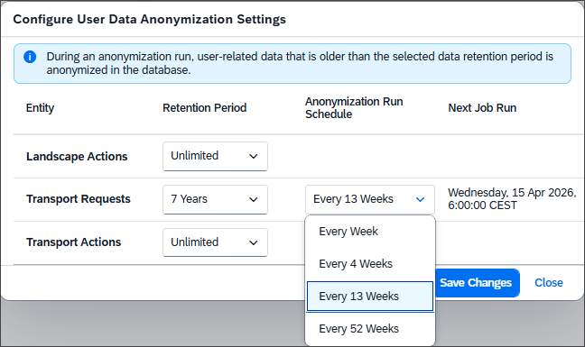

<!-- loiof3c0a3b8189e4a95a901462c248bce07 -->

<link rel="stylesheet" type="text/css" href="../css/sap-icons.css"/>

# Configure User Data Anonymization Settings

User data anonymization settings allow you to configure retention periods and anonymization schedules for any user data displayed as part of landscape actions, transport requests, and transport actions in your SAP Cloud Transport Management subscription.

## Context

By default, SAP Cloud Transport Management stores user-related data, such as user names and e-mail addresses, for an unlimited time. You can set a retention period for user data in the landscape actions, transport requests, and transport actions in your SAP Cloud Transport Management subscription and define schedules for anonymization runs. During these runs, user data that's older than the selected retention periods is anonymized.

Use this feature to ensure compliance with data privacy requirements by automatically anonymizing user data based on your specified criteria.

## Procedure

1.  In the SAP Cloud Transport Management title bar, choose :gear: → :gear:.

    The *Configure User Data Anonymization Settings* dialog opens.

    

2.  Select the values for the different entities from the dropdown menus as required.

    **Configure User Data Anonymization Settings**

    <table>
    <tr>
    <th valign="top">

    Entity
    
    </th>
    <th valign="top">

    Retention Period
    
    </th>
    <th valign="top">

    Anonymization Run Schedule
    
    </th>
    </tr>
    <tr>
    <td valign="top">
    
    *Landscape Actions*
    
    </td>
    <td valign="top" rowspan="3">
    
    You can set the value to 5, 6, 7 years, or *Unlimited*.
    
    </td>
    <td valign="top" rowspan="3">
    
    When you set a value for the retention period, the default schedule is *Every 13 Weeks*.

    You can change the value to *Every Week*, *Every 4 Weeks*, *Every 52 Weeks*.
    
    </td>
    </tr>
    <tr>
    <td valign="top">
    
    *Transport Requests*
    
    </td>
    </tr>
    <tr>
    <td valign="top">
    
    *Transport Actions*
    
    </td>
    </tr>
    </table>
    
3.  Save your changes.

<a name="loiof3c0a3b8189e4a95a901462c248bce07__result_ulh_zx1_4bc"/>

## Results

The changes to the user data anonymization settings are saved.

The configuration change appears in the *Landscape Action Logs* under the following dataset:

-   *Entity Type* = *Configuration*
-   *Action Type* = *Edit*
-   *Affected Object* = *User Data Anonymization*

    > ### Note:  
    > Clicking the *User Data Anonymization* link opens the configuration dialog.

The anonymization job runs as a background job based on the criteria you specified. An anonymization run is logged in the *Landscape Action Logs* under the following dataset:

-   *Entity Type* = *Anonymize*
-   *Action Type* = *Create*
-   *Affected Object* = **<Entity\>**

    \(**<Entity\>** is one of the following: *Landscape Actions*, *Transport Requests*, or *Transport Actions*.\)

    > ### Note:  
    > Click the **<Entity\>** link to open the respective entity overview: *Transport Action Logs*, or *Transport Requests*.

Select the arrow at the end of the row, or click anywhere in the row to display the details of the log entry.

**Related Information**  

[Landscape Action Logs](../landscape-action-logs-7b630db.md "The landscape action logs display the history of all actions related to the landscape configuration in your SAP Cloud Transport Management subscription.")

[SAP Cloud Transport Management Home Screen](../sap-cloud-transport-management-home-screen-9ac7880.md "On the home screen, you have an overview of the most commonly used functions of SAP Cloud Transport Management service with direct access. Using the navigation pane on the left side, you have access to all functions.")

