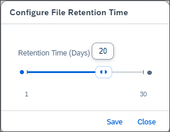

<!-- loio9969d8ddd27f4f9785faaa37e51b1d24 -->

<link rel="stylesheet" type="text/css" href="../css/sap-icons.css"/>

# Configuring File Retention Time

Adjust the retention time for files uploaded to the service, depending on your service plan.

## Context

The default retention time for uploaded files depends on your subscribed service plan is 30 days for *Standard* and 7 days for *Free*. After the configured retention time, an automatic cleanup mechanism deletes files that meet specific criteria. You can adjust the retention time to a supported value based on your service plan: 1 to 30 days for Standard, or 1 to 7 days for Free.

## Procedure

1.  In the SAP Cloud Transport Management title bar, choose :gear: →  File Retention Time.

    The *Configure File Retention Time* dialog opens. The bar indicates the current retention time in days.

      
      
    **Configure File Retention Time Dialog**

    

2.  Select a new retention time by clicking or sliding the retention time bar. Alternatively, enter a value in the input field.

3.  Save your changes.

## Results

The changes to the file retention time are saved.

The configuration change appears in the *Landscape Action Logs* under the following dataset:

-   *Entity Type* = *Configuration*
-   *Action Type* = *Edit*

Select the arrow at the end of the row, or click anywhere in the row to display the details of the log entry.

**Related Information**  

[SAP Cloud Transport Management Home Screen](../sap-cloud-transport-management-home-screen-9ac7880.md "On the home screen, you have an overview of the most commonly used functions of SAP Cloud Transport Management service with direct access. Using the navigation pane on the left side, you have access to all functions.")

[Storage in SAP Cloud Transport Management: What To Know](storage-in-sap-cloud-transport-management-what-to-know-e8d5187.md "Storage management in SAP Cloud Transport Management involves fixed quotas, file size limits, and automatic cleanup based on configurable retention times to avoid running out of space.")

[Landscape Action Logs](../landscape-action-logs-7b630db.md "The landscape action logs display the history of all actions related to the landscape configuration in your SAP Cloud Transport Management subscription.")

