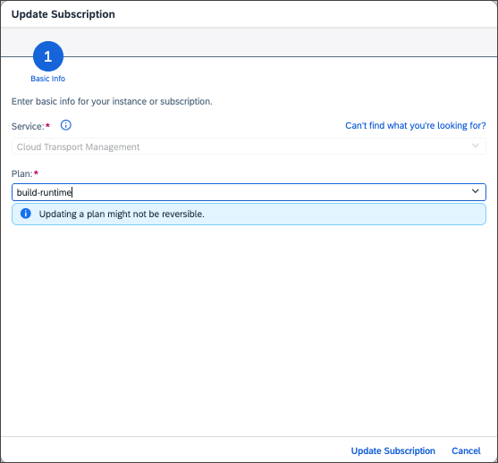
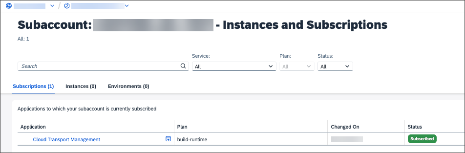

<!-- loio1717e87d6cf94171adbcfba5928c60fe -->

# Updating the Service Plan

To access additional features of the SAP Cloud Transport Management user interface, update the service \(application\) plan.

## Prerequisites

You can find the service plans available for the SAP Cloud Transport Management user interface \(application plans\) in SAP Discovery Center at [SAP Discovery Center Service - Cloud Transport Management](https://discovery-center.cloud.sap/serviceCatalog/cloud-transport-management/?tab=service_plan&region=all).

The following update scenarios are supported:

**Overview: Update Options of SAP Cloud Transport Management Service Plans**

<table>
<tr>
<th valign="top">

Current Application Plan

</th>
<th valign="top">

Target Application Plan

</th>
<th valign="top">

More Information

</th>
</tr>
<tr>
<td valign="top">

*free*

</td>
<td valign="top">

*standard*

</td>
<td valign="top">

To update from the *free* to the *standard* plan, follow the steps of the *Procedure* below.

**Prerequisite**:

-   In the subaccount in which you're using SAP Cloud Transport Management, you've configured an entitlement to the *standard \(Application\)* service plan of SAP Cloud Transport Management as described in [Configuring Entitlements to SAP Cloud Transport Management](../10-initial-setup/configuring-entitlements-to-sap-cloud-transport-management-13894be.md).

</td>
</tr>
<tr>
<td valign="top">

*build-code* / *free* / *standard* 

</td>
<td valign="top">

*build-runtime*

</td>
<td valign="top">

To update from the *build-code*, *free*, or *standard* plans to the *build-runtime* plan, follow the steps of the *Procedure* below.

**Prerequisite**:

-   In the subaccount in which you're using SAP Cloud Transport Management, you've configured an entitlement to the *build-runtime \(Application\)* service plan of SAP Cloud Transport Management as described in [Configuring Entitlements to SAP Cloud Transport Management](../10-initial-setup/configuring-entitlements-to-sap-cloud-transport-management-13894be.md).

</td>
</tr>
</table>

To update your SAP Cloud Transport Management service plan, proceed as follows:

## Procedure

1.  In your subaccount in BTP cockpit, choose *Services* \> *Instances and Subscriptions*.

2.  Select the arrow in the *Cloud Transport Management* row to display the application details.

    

3.  In the details of the application, select the three dots next to the *Go to Application* button, and from the menu, select *Update*.

    

4.  In the *Update Subscription* dialog, select the target plan, and choose *Update Subscription*.

    > ### Note:  
    > In the screenshot, the *build-runtime* plan is selected. If you update from *free* to *standard*, select *standard* as the target plan.

    

    The plan was updated to *build-runtime*.

    

