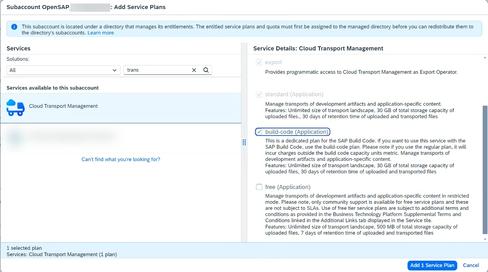
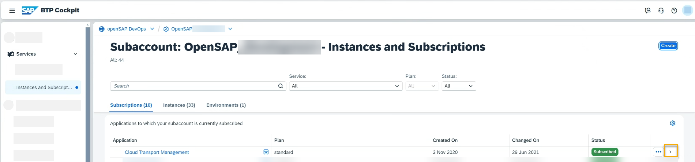
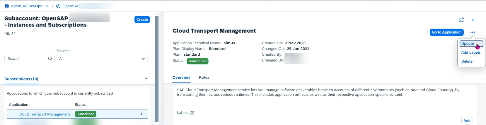
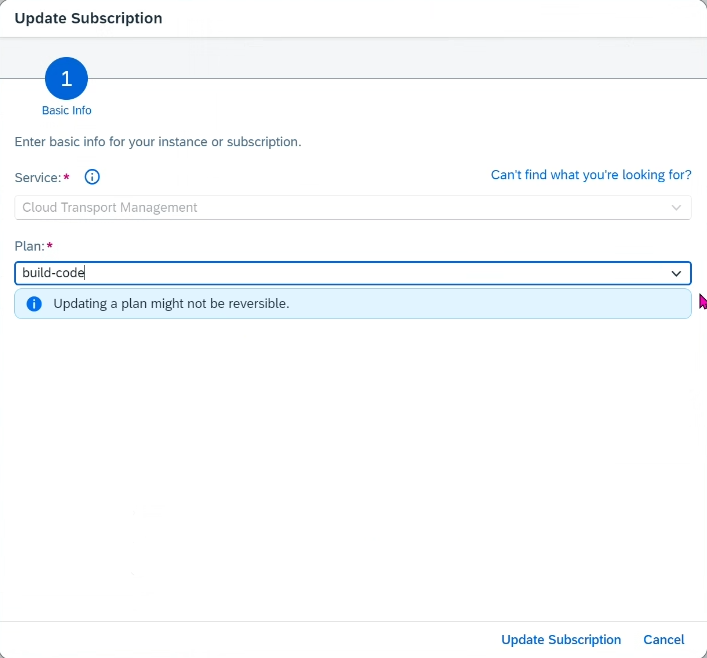

<!-- loio1717e87d6cf94171adbcfba5928c60fe -->

# Updating the Service Plan

To access additional features of the SAP Cloud Transport Management user interface, update the service \(application\) plan.

## Prerequisites

You can find the service plans available for the SAP Cloud Transport Management user interface \(application plans\) in SAP Discovery Center at [SAP Discovery Center Service - Cloud Transport Management](https://discovery-center.cloud.sap/serviceCatalog/cloud-transport-management/?tab=service_plan&region=all).

The following update scenarios are supported:

**Overview: Update Options of SAP Cloud Transport Management Service Plans**

<table>
<tr>
<th valign="top">

Current Application Plan

</th>
<th valign="top">

Target Application Plan

</th>
<th valign="top">

More Information

</th>
</tr>
<tr>
<td valign="top">

*free*

</td>
<td valign="top">

*standard*

</td>
<td valign="top">

To update from the *free* to the *standard* plan, follow the steps of the *Procedure* below.

**Prerequisite**:

-   In the subaccount in which you're using SAP Cloud Transport Management, you've configured an entitlement to the *standard \(Application\)* service plan of SAP Cloud Transport Management as described in [Configuring Entitlements to SAP Cloud Transport Management](../10-initial-setup/configuring-entitlements-to-sap-cloud-transport-management-13894be.md).

</td>
</tr>
<tr>
<td valign="top">

*free*/ *standard*

</td>
<td valign="top">

*build-code*

</td>
<td valign="top">

If you have previously used SAP Cloud Transport Management service, and you now want to use the service to transport SAP Build Code content, the procedure differs depending on whether you want to use SAP Cloud Transport Management exclusively to transport content that was created using SAP Build Code, or also for other content. Proceed as follows:

-   If you want to use SAP Cloud Transport Management exclusively to transport SAP Build Code content, update the service plan to the *build-code* plan as described in the *Procedure* below.

    **Prerequisites**:

    -   You've configured an entitlement to SAP Build Code and subscribed to it using the *Get Started with SAP Build Code* booster. When using the booster, you've deselected the SAP Cloud Transport Management instance. The reason for this is that it's not necessary to create a new SAP Cloud Transport Management instance since you already have one. For more information about using the booster, see [Initial Setup](https://help.sap.com/docs/build_code/d0d8f5bfc3d640478854e6f4e7c7584a/07698d7c31284e4db370acdf017cfd14.html) in the SAP Build Code documentation.

    -   In the subaccount in which you're using SAP Cloud Transport Management, you've configured an entitlement to the *build-code \(Application\)* service plan of SAP Cloud Transport Management as described in [Configuring Entitlements to SAP Cloud Transport Management](../10-initial-setup/configuring-entitlements-to-sap-cloud-transport-management-13894be.md).

        

        > ### Note:  
        > If you're assigning the plan to a subaccount which is under a directory that's configured to manage entitlements you must add the service plan first to the managed directory.

-   If you want to continue using SAP Cloud Transport Management as before \(to transport content that's different from the content created using the tools that are part of SAP Build Code\), and *additionally* as part of SAP Build Code, don't update your existing service plan to the *build-code* plan. Instead, create a new SAP Cloud Transport Management instance and assign the *build-code* plan to the new instance. Use the *Get Started with SAP Build Code* booster to configure an entitlement and subscribe to SAP Build Code. Leave the SAP Cloud Transport Management instance selected so that a new SAP Cloud Transport Management instance for use with SAP Build Code is created in the process. Note that you can use several instances of SAP Cloud Transport Management in your global account. For more information about using the booster, see [Initial Setup](https://help.sap.com/docs/build_code/d0d8f5bfc3d640478854e6f4e7c7584a/07698d7c31284e4db370acdf017cfd14.html) in the SAP Build Code documentation.

</td>
</tr>
</table>

To update your SAP Cloud Transport Management service plan, proceed as follows:

## Procedure

1.  In your subaccount in BTP cockpit, choose *Services* \> *Instances and Subscriptions*.

2.  Select the arrow in the *Cloud Transport Management* row to display the application details.

    

3.  In the details of the application, select the three dots next to the *Go to Application* button, and from the menu, select *Update*.

    

4.  In the *Update Subscription* dialog, select the target plan, and choose *Update Subscription*.

    > ### Note:  
    > In the screenshot, the *build-code* plan is selected. If you update from *free* to *standard*, select *standard* as the target plan.

    

