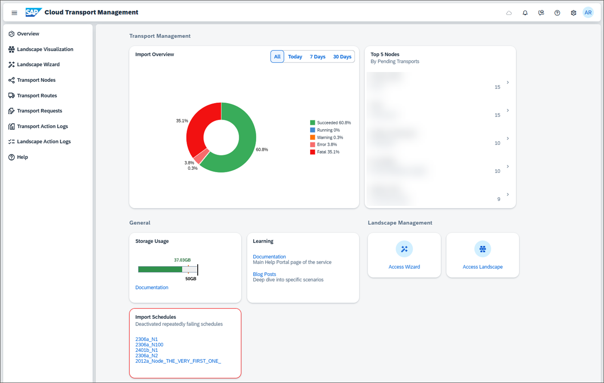
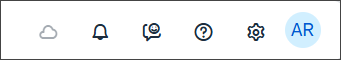
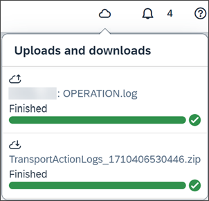
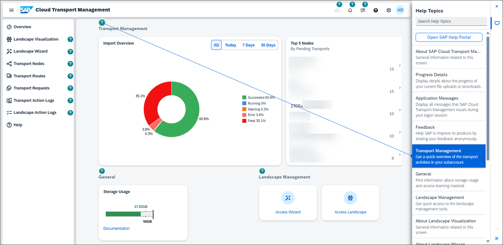
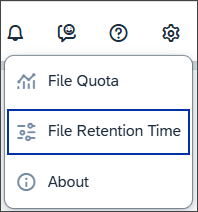
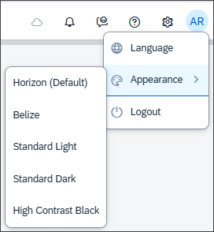

<!-- loio9ac7880eddb14eeda89b800295bcf242 -->

<link rel="stylesheet" type="text/css" href="css/sap-icons.css"/>

# SAP Cloud Transport Management Home Screen

On the home screen, you have an overview of the most commonly used functions of SAP Cloud Transport Management service with direct access. Using the navigation pane on the left side, you have access to all functions.

### Navigation Pane

Use the navigation pane to access all functions available in SAP Cloud Transport Management, such as configuring the landscape, executing, or monitoring transports.

### Transport Management

On the *Transport Management* section on the home screen, you get an overview of imports and about the transport nodes with pending transports.

### Import Overview

The pie chart gives an overview of the imports. You can select the time interval for which you want to display the chart, and you can directly navigate to the relevant *Transport Action Logs*.

### Top n Nodes

The list contains transport nodes whose import queues have the highest number of transports in an importable state. These are transports in one of the following statuses: *Initial*, *Fatal*, or *Repeatable*. To navigate to the import queue of a specific transport node, click anywhere in the row.

For more information, see [Create Transport Nodes](20-configure-landscape/create-transport-nodes-f71a4d5.md).

### Landscape Management

On the *Landscape Management* section on the home screen, you can navigate to the *Transport Landscape Wizard* or to the *Landscape Visualization* to configure your transport landscape.

### Access Wizard

Access the *Transport Landscape Wizard* that allows you to easily configure simple transport landscapes. If you know the number of transport nodes of which your landscape will consist, you can configure the landscape using a template.

For more information, see [Use the Transport Landscape Wizard](20-configure-landscape/use-the-transport-landscape-wizard-f14192e.md).

### Title Bar

In the title bar, you can use the following functions:

<table>
<tr>
<td valign="top">

**Monitor Progress of File Upload and Download Processes**

When you're uploading or downloading larger files, the :cloud: icon is available in the import queue of a transport node. It allows you to monitor the progress of file upload and download processes. The progress of all file uploads and downloads of your user in the current browser session is displayed.

For more information, see [Add Files to Import Queues](30-using-import-queue/add-files-to-import-queues-c3c87cb.md).

</td>
</tr>
<tr>
<td valign="top">

**Application Messages**

You can display all messages that SAP Cloud Transport Management issues during your logon session. To do this, click on the :bell: icon.

</td>
</tr>
<tr>
<td valign="top">

**In-App Help**

You can display in-app help by clicking on  In-App Help. An information bar appears on the right-hand side of the screen, and text elements in the bar are linked with elements on the screen. To get help on a screen element, click on the circle.

When in-app help is enabled, the question mark icon changes to .

</td>
</tr>
<tr>
<td valign="top">

**Logon Email Address**

Clicking on your logon email address or the dropdown arrow on the top right provides the following options:

<table>
<tr>
<th valign="top">

Option

</th>
<th valign="top">

Description

</th>
</tr>
<tr>
<td valign="top">

*My File Quota*

</td>
<td valign="top">

Get more information about your file quota.

If you've configured SAP Alert Notification Service to send notifications for a transport node and you want to receive warning notifications when you've reached at least 85% of the storage capacity in your space, you can select the *Enable Notifications* checkbox.

See also:

-   [Receive Notifications for SAP Cloud Transport Management Actions Using SAP Alert Notification Service](receive-notifications-for-sap-cloud-transport-management-actions-using-sap-alert-notifica-95d4fc7.md)
-   [Background Information: Storage Capacity](50-administration/background-information-storage-capacity-e8d5187.md)

</td>
</tr>
<tr>
<td valign="top">

*File Retention Time*

</td>
<td valign="top">

Find out more about the retention time for files that were uploaded to the service, or change the default retention time to a supported value \(depending on the service plan\).

The default retention time depends on the subscribed service plan. After the configured retention time, files that meet specific criteria are deleted by an automatic cleanup mechanism. For more information, see [Background Information: Storage Capacity](50-administration/background-information-storage-capacity-e8d5187.md).

Adjust the retention time by clicking in the bar or entering the new value in the input field. The bar indicates the supported interval.

</td>
</tr>
<tr>
<td valign="top">

*About*

</td>
<td valign="top">

Find out the current version of SAP Cloud Transport Management.

</td>
</tr>
<tr>
<td valign="top">

*Language*

</td>
<td valign="top">

Switch the display language of the SAP Cloud Transport Management UI.

The SAP Cloud Transport Management UI is available in Chinese and English. By default, it's displayed in the default language of the web browser.

</td>
</tr>
<tr>
<td valign="top">

*Appearance*

</td>
<td valign="top">

Change the default *Horizon* style theme of the UI to *Belize*, *Standard Light*, *Standard Dark*, or *High Contrast Black*.

</td>
</tr>
</table>

</td>
</tr>
</table>

### Access Landscape

Access the *Landscape Visualization* that allows you to easily configure transport landscapes in a visual display.

For more information, see [Using the Landscape Visualization](using-the-landscape-visualization-9fea4f2.md).

### General

This section contains information about the maximum storage capacity and the current storage usage, and links to useful learning material about SAP Cloud Transport Management.

### Failed Import Schedules

If a scheduled import has failed with a fatal error at least three times in a row over a period of at least three weeks, the corresponding schedule is automatically deactivated, and the affected transport node is displayed. To reactivate the import scheduler, choose the import queue link.

For more information, see [Schedule Imports](30-using-import-queue/schedule-imports-110a7a4.md).

