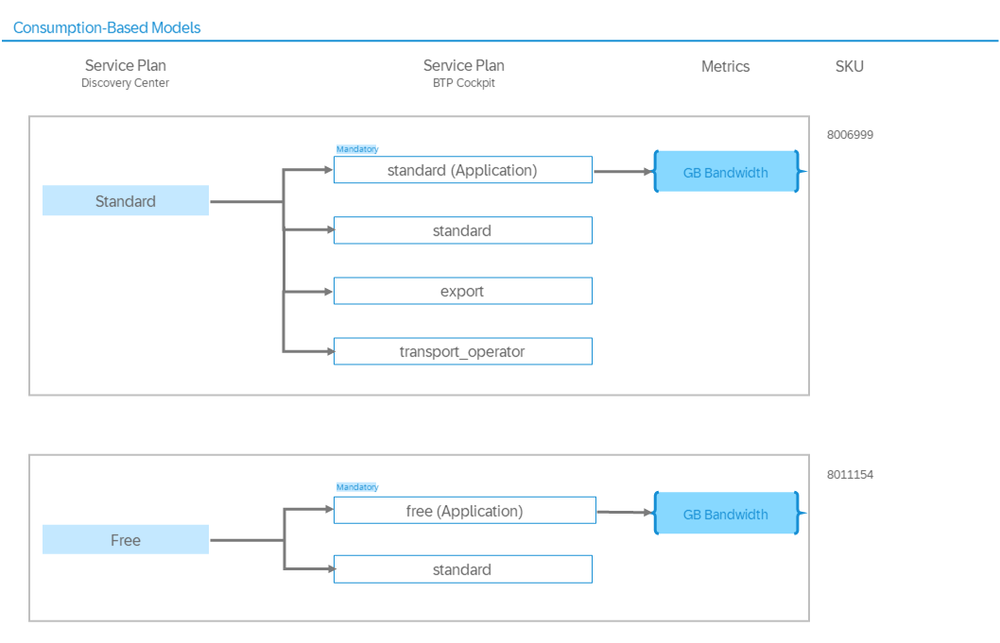

<!-- loio17c102d217f446a1bb56453ac5cd75c6 -->

# Service Plans and Metering

This page explains the relationship between the service plans in the SAP Discovery Center and those in the SAP BTP cockpit, and provides information to help you understand how the service is billed.

<a name="loio17c102d217f446a1bb56453ac5cd75c6__section_gwp_yyy_5zb"/>

## Service

### Overview

SAP Cloud Transport Management is accessible through the consumption-based commercial model.

<a name="loio17c102d217f446a1bb56453ac5cd75c6__section_hbp_bwc_w1c"/>

## Service Plans

SAP Cloud Transport Management offers the Standard and Free service plans of type *Application* that you can use to work with the service. In addition, the service offers the optional standard, export, and transport\_operator service plans of type *Instance* that you can use when you need programmatic access to the service.

### SAP Cloud Transport Management: Service Plans

The following application plans are available for SAP Cloud Transport Management.

**Application Plans**

<table>
<tr>
<th valign="top">

Name in SAP BTP Cockpit

</th>
<th valign="top">

Service Plan in SAP Discovery Center

</th>
<th valign="top">

Description

</th>
<th valign="top">

More Information

</th>
</tr>
<tr>
<td valign="top">

*standard \(Application\)*

</td>
<td valign="top">

Standard

</td>
<td valign="top">

Manage transports of development artifacts and application-specific content

</td>
<td valign="top">

Default plan to use SAP Cloud Transport Management.

**Features:** Unlimited size of transport landscape. 50 GB of total storage capacity of uploaded files. 1GB maximum individual file size. 30 days retention time of uploaded and transported files.

</td>
</tr>
<tr>
<td valign="top">

*build-runtime \(Application\)*

</td>
<td valign="top">

n/a

</td>
<td valign="top">

Manage transports of development artifacts and application-specific content

</td>
<td valign="top">

Plan to be used, if you use SAP Cloud Transport Management to transport content created using a service from the SAP Build ecosystem.

**Features:** Unlimited size of transport landscape. 50 GB of total storage capacity of uploaded files. 1GB maximum individual file size. 30 days retention time of uploaded and transported files.

</td>
</tr>
<tr>
<td valign="top">

*free \(Application\)*

</td>
<td valign="top">

Free

</td>
<td valign="top">

Restricted mode. Only community support is available for free tier service plans and these are not subject to SLAs.

</td>
<td valign="top">

Plan to use SAP Cloud Transport Management with a reduced scope for testing purposes.

**Features:** Unlimited size of transport landscape. 500 MB of total storage capacity of uploaded files. 500 MB maximum individual file size. 7 days retention time of uploaded and transported files.

</td>
</tr>
</table>

The instance plans offered by the service are optional free plans to access the service through its API. For example, you need one of the plans in scenarios where the service is integrated into another service and you start transporting content archives directly from your application or service.

**Instance Plans**

<table>
<tr>
<th valign="top">

Name in SAP BTP Cockpit

</th>
<th valign="top">

Service Plan in SAP Discovery Center

</th>
<th valign="top">

Description

</th>
<th valign="top">

More Information

</th>
</tr>
<tr>
<td valign="top">

*standard*

</td>
<td valign="top">

n/a

</td>
<td valign="top">

Provides programmatic access to Cloud Transport Management.

</td>
<td valign="top">

Default plan to access SAP Cloud Transport Management using programmatic access.

This plan provides full access to the Cloud Transport Management API. Use it for all standard integrations with SAP Cloud Transport Management. This includes integrations from SAP Cloud ALM and Change Request Management/Quality Gate Management of SAP Solution Manager.

</td>
</tr>
<tr>
<td valign="top">

*export*

</td>
<td valign="top">

n/a

</td>
<td valign="top">

Provides programmatic access to Cloud Transport Management as Export Operator.

</td>
<td valign="top">

Plan to access SAP Cloud Transport Management using programmatic access with reduced authorizations for export actions only. This plan allows file upload and node upload/export actions.

Use this service plan to restrict access to SAP Cloud Transport Management, if enhanced security requirements are required. Use it, for example for the integration with SAP Solution Lifecycle Management service or CI/CD pipelines.

</td>
</tr>
<tr>
<td valign="top">

*transport\_operator*

</td>
<td valign="top">

n/a

</td>
<td valign="top">

Provides programmatic access to Cloud Transport Management as Transport Operator.

</td>
<td valign="top">

Plan to access SAP Cloud Transport Management using programmatic access with reduced authorizations for transport operator actions only. This plan allows import, reset, forward, and delete actions.

Use this service plan to restrict access to SAP Cloud Transport Management, if enhanced security requirements are required.

</td>
</tr>
</table>

More information:

-   Service plans for SAP Cloud Transport Management: See [SAP Discovery Center](https://discovery-center.cloud.sap/serviceCatalog/cloud-transport-management?tab=service_plan&region=all)

-   Restrictions based on service plans: See [Storage in SAP Cloud Transport Management: What To Know](50-administration/storage-in-sap-cloud-transport-management-what-to-know-e8d5187.md)

-   Commercial models: See [Commercial Models](https://help.sap.com/docs/btp/sap-business-technology-platform/commercial-models)

<a name="loio17c102d217f446a1bb56453ac5cd75c6__section_x43_x1z_5zb"/>

## Metrics

<table>
<tr>
<th valign="top">

Metric

</th>
<th valign="top">

Definition

</th>
</tr>
<tr>
<td valign="top">

GB Bandwidth

</td>
<td valign="top">

Amount of data traffic transmitted and received by the Cloud Service.

</td>
</tr>
</table>

Example: The total capacity of files that can be uploaded to the service in the Standard plan is 50 GB. The size limit of an individual file uploaded to the service is 1 GB.

<a name="loio17c102d217f446a1bb56453ac5cd75c6__section_mjy_gbz_5zb"/>

## Supplemental Terms and Conditions

For more information, see the [SAP Business Technology Platform Service Description Guide](https://www.sap.com/about/trust-center/agreements/cloud/cloud-services.html?sort=latest_desc&tag=language%3Aenglish&pdf-asset=82ce6fed-917e-0010-bca6-c68f7e60039b&page=1), SAP CLOUD TRANSPORT MANAGEMENT section.

<a name="loio17c102d217f446a1bb56453ac5cd75c6__section_bl4_4tz_5zb"/>

## Glossary

[Commercial Information Glossary](https://help.sap.com/docs/help/5d771150f8f547c6bc604c7d674cf30d/7014f9db099148f1897c1bda5db21f39.html)

<a name="loio17c102d217f446a1bb56453ac5cd75c6__section_ypn_rtz_5zb"/>

## Service Specifics

Billing in SAP Cloud Transport Management is based on content uploaded or exported to the service from external sources, such as other services. The service meters content only once at the first upload. Imports into target nodes don't incur additional charges. When you use the *standard \(Application\)* plan, usage is aggregated at the global account level and billed monthly per started GB of data traffic.

Note the following points about the integration of SAP Cloud Transport Management with other services:

-   **SAP Build**:

    SAP Cloud Transport Management is a runtime service of the SAP Build ecosystem. If you use it as part of SAP Build, you can update to the *build-runtime \(Application\)* plan. For more information, see [Updating the Service Plan](50-administration/updating-the-service-plan-1717e87.md). When you use the *build-runtime \(Application\)* plan, usage is billed based on capacity units. The actual billing details are governed by service plans of SAP Build. For more information about these, see [Service Plans and Metering](https://help.sap.com/docs/SAP_BUILD/411a94a7191243e0a99c9af3a061cee9/a90ad466d2024e6fb2c2c063af47e659.html) in the *SAP Build - Service Guide*.

-   **Enhanced or Premium Edition of SAP Integration Suite**:

    SAP Cloud Transport Management is included in the Enhanced and Premium Editions of SAP Integration Suite. Usage of the service is restricted to SAP Integration Suite artifacts and is included in the subscription up to a specific cap. For more information about the SAP Integration Suite editions and links to additional resources, see [2903776](https://me.sap.com/notes/2903776) - *SAP Integration Suite – Service Plans and Upgrade Paths*.

