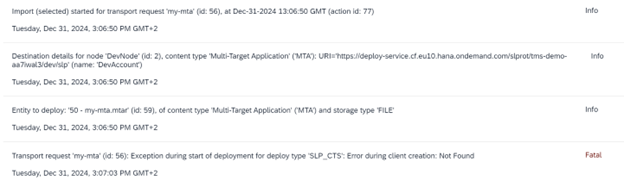
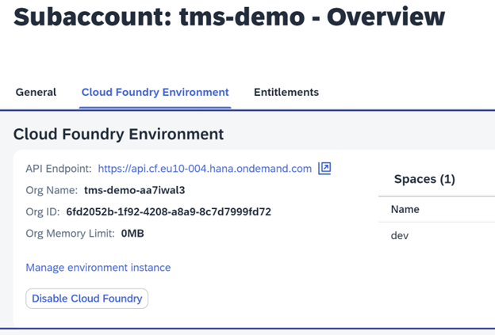
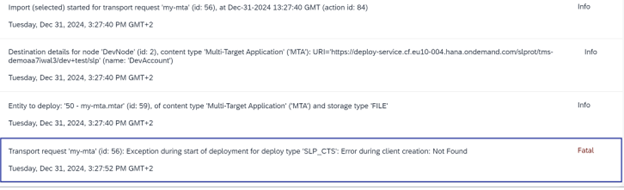
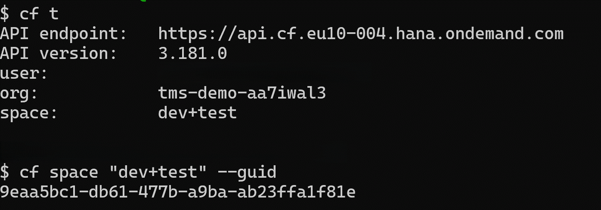
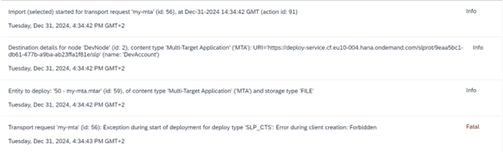
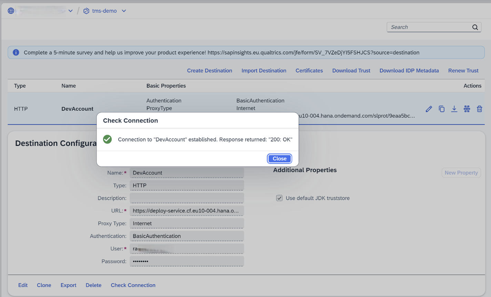
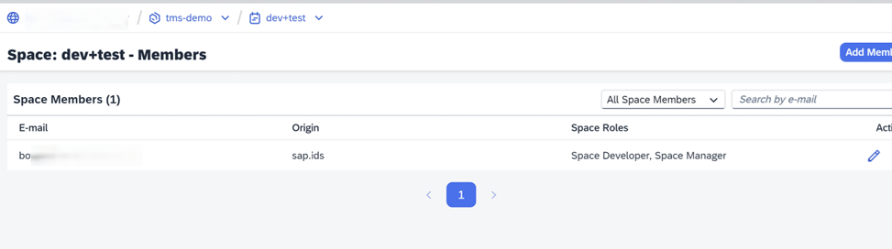
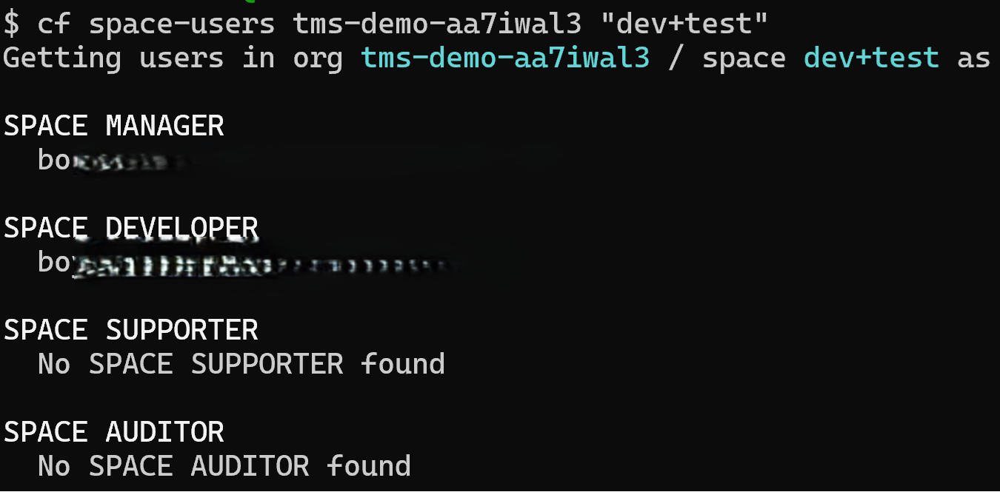

<!-- loio3f7a9bc6a9cf4cb5aa3d41e6cd457687 -->

# Troubleshooting Issues when Transporting Multitarget Applications \(MTAs\)

Find information about how to solve issues that can arise when you use SAP Cloud Transport Management to transport Multitarget Applications \(MTAs\) in Cloud Foundry using SAP Cloud Deployment service for deployment.


The configuration of the transport landscape for MTAs on Cloud Foundry involves creating transport destinations to address the target API endpoints of the deployment process. Problems can arise, if a transport destination isn't correctly configured, or if the user used for the deployment doesn't have sufficient privileges on the target Cloud Foundry subaccount. For information about how to configure destinations, see [Creating Destinations for MTA Deployment on Cloud Foundry](20-configure-landscape/creating-destinations-for-mta-deployment-on-cloud-foundry-881d752.md).

The following sections describe errors that come up in the transport action logs, and proposed solutions:

**Error Messages and Proposed Solutions**


<table>
<tr>
<th valign="top">

Error Message

</th>
<th valign="top">

Issue and Proposed Solution

</th>
</tr>
<tr>
<td valign="top" rowspan="2">

*Exception during start of deployment for deploy type 'SLP\_CTS': Error during client creation: Not Found*

</td>
<td valign="top">

[Issue 1: Destination URL Points to Incorrect Cloud Foundry Domain](troubleshooting-issues-when-transporting-multitarget-applications-mtas-3f7a9bc.md#loio3f7a9bc6a9cf4cb5aa3d41e6cd457687__not-found-iss1)

</td>
</tr>
<tr>
<td valign="top">

[Issue 2: Destination URL Points to Incorrect Cloud Foundry Org/Space](troubleshooting-issues-when-transporting-multitarget-applications-mtas-3f7a9bc.md#loio3f7a9bc6a9cf4cb5aa3d41e6cd457687__not-found-iss2)

</td>
</tr>
<tr>
<td valign="top" rowspan="2">

*Exception during start of deployment for deploy type 'SLP\_CTS': Error during client creation: Forbidden*

</td>
<td valign="top">

[Issue 1: User in Destination without Required Privileges](troubleshooting-issues-when-transporting-multitarget-applications-mtas-3f7a9bc.md#loio3f7a9bc6a9cf4cb5aa3d41e6cd457687__forbidden-iss1)

</td>
</tr>
<tr>
<td valign="top">

[Issue 2: User in Destination from Incorrect Identity Provider](troubleshooting-issues-when-transporting-multitarget-applications-mtas-3f7a9bc.md#loio3f7a9bc6a9cf4cb5aa3d41e6cd457687__forbidden-iss2)

</td>
</tr>
</table>


### Error: *Exception during start of deployment for deploy type 'SLP\_CTS': Error during client creation: Not Found*

**Issue 1: Destination URL Points to Incorrect Cloud Foundry Domain**

**Context**

You can declare the URL to SAP Cloud Deployment service in one of the following ways:

-   Using the names of your org and space:

    <code>https://deploy-service.cf.<i class="varname">&lt;domain&gt;</i>/slprot/<i class="varname">&lt;myorg&gt;</i>/<i class="varname">&lt;myspace&gt;</i>/slp</code>

-   Using the GUID of your space

    <code>https://deploy-service.cf.<i class="varname">&lt;domain&gt;</i>/slprot/<i class="varname">&lt;my-space-guid&gt;</i>/slp</code>


Sometimes, when the domain isn't configured correctly, the import of the transport request fails right at the start. You'll see an error message similar to this:

*Exception during start of deployment for deploy type 'SLP\_CTS': Error during client creation: Not Found*



The problem appears even if *Check Connection* of the destination was successful.

**Proposed Solution of Issue 1**

Make sure that the URL in the destination to SAP Cloud Deployment service matches the correct domain of the target Cloud Foundry org and space where you want to import the MTAs. There's always a 1-to-1 mapping between the URL to SAP Cloud Deployment service and the Cloud Foundry API endpoint.

> ### Note:  
> Some Cloud Foundry environments have multiple Cloud Foundry API endpoints. You can find the complete list of Cloud Foundry regions and their API endpoints in [Regions and API Endpoints Available for the Cloud Foundry Environment](https://help.sap.com/docs/BTP/65de2977205c403bbc107264b8eccf4b/f344a57233d34199b2123b9620d0bb41.html).

In the example, the destination URL is incorrect because it points to the wrong domain:

-   Destination URL: `https://deploy-service.cf.eu10.hana.ondemand.com/slprot/tms-demo-aa7iwal3/dev/slp` 
-   Wrong domain: `eu10.hana.ondemand.com`

    The domain points to the API endpoint `api.eu10.hana.ondemand.com`.

-   Correct domain: `eu10-004.hana.ondemand.com`

    The domain points to the API endpoint `api.eu10-004.hana.ondemand.com`.


> ### Note:  
> You can find the API endpoint in one of the following ways:
> 
> -   Use SAP BTP cockpit. In the *Subaccount Overview*, go to the *Cloud Foundry Environment* tab.
> 
>     
> 
> -   Use the [Cloud Foundry Command Line Interface](https://help.sap.com/docs/BTP/65de2977205c403bbc107264b8eccf4b/2f1d4abd0f9f4760a301f43513d2efa6.html) \(cf CLI\).
> 
>     Execute the command:
> 
>     ```
>     $ cf api
>     ```
> 
>     The correct API endpoint is displayed: `https://api.cf.eu10-004.hana.ondemand.com`

**Issue 2: Destination URL Points to Incorrect Cloud Foundry Org/Space**

**Context**

You can declare the URL to SAP Cloud Deployment service in one of the following ways:

-   Using the names of your org and space:

    <code>https://deploy-service.cf.<i class="varname">&lt;domain&gt;</i>/slprot/<i class="varname">&lt;myorg&gt;</i>/<i class="varname">&lt;myspace&gt;</i>/slp</code>

-   Using the GUID of your space

    <code>https://deploy-service.cf.<i class="varname">&lt;domain&gt;</i>/slprot/<i class="varname">&lt;my-space-guid&gt;</i>/slp</code>


Sometimes, the Cloud Foundry org name includes special characters such as whitespaces \(`' '`\) or slashes \(`'/'`\). These characters aren't accepted as part of the URL path. This issue can arise, if the org was initially set up using the standard pattern that includes the company name.

When this happens, the import of the transport request fails. You'll see an error message similar to this:

*Exception during start of deployment for deploy type 'SLP\_CTS': Error during client creation: Not Found*



The problem appears even if *Check Connection* of the destination was successful.

**Proposed Solution of Issue 2**

To solve the problem, you have the following options:

-   Make sure you properly URL encode both the org and space names. In the example above, the space name is `dev+test`, where the plus symbol \(`+`\) must be encoded. To encode the names, you can use any local or online tool, such as [https://www.urlencoder.org/](https://www.urlencoder.org/). As a result of encoding, you'll get the value `dev%2Btest`.

    > ### Note:  
    > You need to URL encode the org name and space name separately before combining them into the destination URL <code><i class="varname">&lt;org&gt;</i>/<i class="varname">&lt;space&gt;</i></code>. This is necessary because otherwise, the slash \(`'/'`\) will be encoded as well, which isn't expected by SAP Cloud Deployment service.

-   \[Recommended\] Switch to declaring the URL based on the GUID of your space.

    To retrieve the GUID, use the [Cloud Foundry Command Line Interface](https://help.sap.com/docs/btp/sap-business-technology-platform/working-with-cloud-foundry-command-line-interface) \(cf CLI\) and execute the command:

    ```
    cf space <my-space-name> --guid
    ```

    You'll get the correct space GUID.

    

    This approach is a better option because the space GUID follows the standard GUID format, which is more suitable for HTTP calls. An additional benefit is that the space GUID is stable, whereas org and space names could change over time.

    However, if you have automated pipelines that re-create spaces frequently, such as for testing purposes where new spaces are created regularly, avoid using space GUID-based URLs. In those cases, we recommend using the combination of org and space names.


### Error: "Exception during start of deployment for deploy type 'SLP\_CTS': Error during client creation: Forbidden"

**Issue 1: User in Destination without Required Privileges**

**Context**

Certain operations in a Cloud Foundry org/space, such as deployments and transports of MTAs, require a valid platform user. This user must have the `SpaceDeveloper` role assigned in the target Cloud Foundry org/space.

The import of a transport request fails with the error message:

*Exception during start of deployment for deploy type 'SLP\_CTS': Error during client creation: Forbidden*



The problem appears even if *Check Connection* of the destination was successful.



Note that the user name configured in the destination starts with "ra".

**Proposed Solution of Issue 1**

Check that the user used for the destination exists with the `SpaceDeveloper` role assigned in the target subaccount. You have the following options:

-   In SAP BTP cockpit, go to your subaccount, and choose: *Cloud Foundry* \> *Spaces* from the navigation on the left. Click on the space tile. Choose *Space Members* from the navigation.

    

    The user starting with “ra” doesn't exist at all.

-   In cf CLI, execute the command:

    ```
    cf space-users <org> <space>
    ```

    .

    


**Issue 2: User in Destination from Incorrect Identity Provider**

**Context**

Certain operations in a Cloud Foundry org/space, such as deployments and transports of MTAs, require a valid platform user. This user must have the `SpaceDeveloper` role assigned in the target Cloud Foundry org/space.

The import of a transport request fails with the error message:


The problem appears even if *Check Connection* of the destination was successful.


**Proposed Solution of Issue 2**

Sometimes, one user name might exist in multiple identity providers. In these cases, you must ensure that the user name specified in the destination from that exact identity provider has the `SpaceDeveloper` role assigned.

For users from custom identity providers, use [destinations using SAP Cloud Deployment service with OAuth2Password authentication](20-configure-landscape/creating-destinations-using-sap-cloud-deployment-service-with-oauth2password-authenticati-a26a721.md).

**Related Information**  


[SAP Note 3224927](https://me.sap.com/notes/3224927 "Cloud TMS: Error during deployment initialization: Unauthorized")

