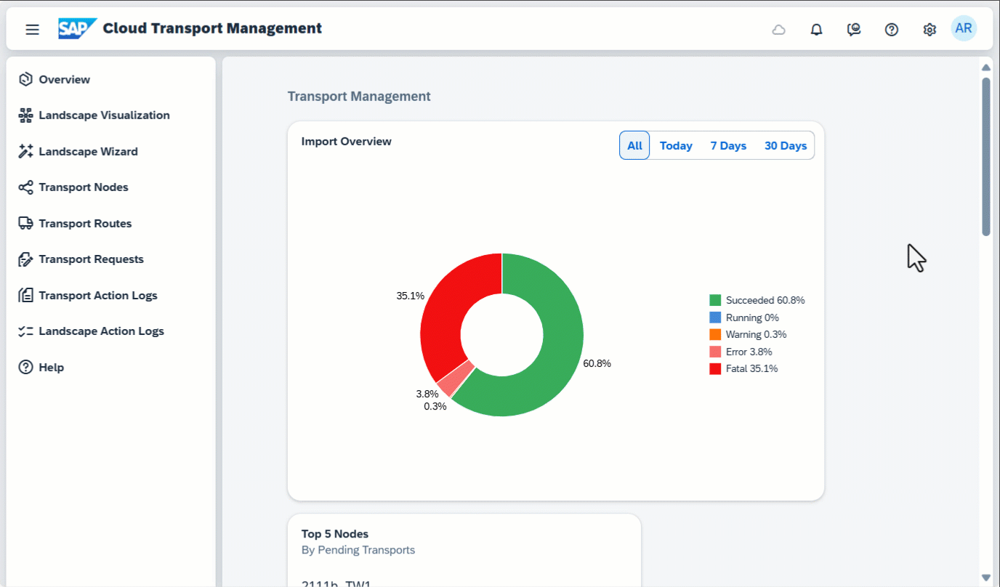
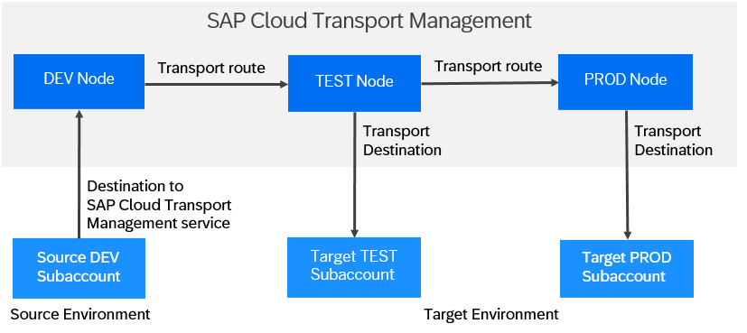

<!-- loio5fef9d6b1cb047b2b18d9eb57aa15352 -->

<link rel="stylesheet" type="text/css" href="css/sap-icons.css"/>

# What Is SAP Cloud Transport Management

Learn more about SAP Cloud Transport Management service for SAP Business Technology Platform \(SAP BTP\).

Manage transports of development artifacts and application-specific content.

SAP Cloud Transport Management service lets you manage software deliverables between accounts of different environments \(such as Cloud Foundry, ABAP, and Neo\), by transporting them across various runtimes. This includes application artifacts as well as their respective application-specific content.

SAP Cloud Transport Management service adds transparency to the audit trail of changes so that you get information about who performed which changes in your production environment, and when they did it. At the same time, the service enables a separation of concerns: For example, a developer of an application or of SAP Cloud content artifacts can trigger the transport of changes from within the development environment, while the resulting import into the test, and production environment is handled by a central operations team.

> ### Tip:  
> SAP Cloud Transport Management service is an *additional* service that must be integrated into the existing development processes of the cloud services or applications whose content it transports. Moreover, the service can be integrated into the change management processes of other services or tools. We recommend that you always start reading the documentation of the application whose content you want to transport to learn about the required configuration tasks.

> ### Tip:  
> The English version of this documentation is open for contributions and feedback using GitHub. This allows you to get in contact with the responsible authors of SAP Help Portal pages of SAP Cloud Transport Management to discuss documentation-related issues. To contribute to this documentation, or to provide feedback, choose the corresponding option on SAP Help Portal:
> 
> -   *Feedback* \> *Create issue*: Provide feedback about a documentation page. This option opens an issue on GitHub.
> 
> -   *Feedback* \> *Edit page*: Contribute to a documentation page. This option opens a pull request on GitHub.
> 
> 
> You need a GitHub account to use these options.
> 
> More information:
> 
> -   [Contribution Guidelines](https://help.sap.com/docs/open-documentation-initiative/contribution-guidelines/readme.html)
> 
> -   [Introduction Video: Open Documentation Initiative](https://www.youtube.com/watch?v=WJ0oarMlVW4)
> 
> -   [Blog Post: Introducing the Open Documentation Initiative](https://blogs.sap.com/2021/05/20/introducing-the-open-documentation-initiative/)

> ### Note:  
> In-app help is available on the user interface of SAP Cloud Transport Management. To activate this help, from the title bar, choose  In-App Help. A panel with help topics opens alongside your current screen. The help topics are associated with elements on the screen using green  icons. Select the icons to learn more about the associated element.
> 
> This animated GIF shows how to use the in-app help:
> 
> 

<a name="loio5fef9d6b1cb047b2b18d9eb57aa15352__section_z1d_txn_slb"/>

## Features

<dl>
<dt><b>

Better control of changes 

</b></dt>
<dd>

By enabling transport management, you add better control for the propagation of changes towards your production cloud environments

</dd><dt><b>

Fully cloud-based 

</b></dt>
<dd>

Handle transports without the need for an on-premise system, other additional infrastructure, or any third-party services

</dd><dt><b>

Integrated experience 

</b></dt>
<dd>

Trigger transports directly from enabled app-specific content creation tools \(such as SAP Cloud Integration Web UI\)

</dd><dt><b>

Transport various types of content 

</b></dt>
<dd>

Handle the transport of development content \(in the form of Multitarget Application archives\) and application-specific content \(such as SAP Cloud Integration iFlows\)

</dd><dt><b>

Transport to different environments 

</b></dt>
<dd>

Source and targets of transports can reside in different global accounts. SAP Cloud Transport Management can handle transports in the Cloud Foundry, ABAP, and Neo environments.

</dd><dt><b>

Model also complex transport landscapes 

</b></dt>
<dd>

Model logical representations of your source and target environments and connecting routes between them – allows also modelling of complex landscapes, such as of star topologies

</dd><dt><b>

Complement CI/CD approaches 

</b></dt>
<dd>

Increase control concerning the propagation of changes towards your production environment by integrating Cloud Transport Management with your continuous integration/continuous delivery \(CI/CD\) solution

</dd><dt><b>

Flexibly handle imports 

</b></dt>
<dd>

Import all transport requests of an import queue in one go or import only selected requests. Full imports can also be scheduled to run automatically.

</dd>
</dl>

<a name="loio5fef9d6b1cb047b2b18d9eb57aa15352__section_wjh_wxn_slb"/>

## Environment

This service is available in the following environments:

-   Cloud Foundry environment
-   Kyma environment

SAP Cloud Transport Management is a multi-tenant aware application and provides a tenant separation.

<a name="loio5fef9d6b1cb047b2b18d9eb57aa15352__section_abd_txn_slb"/>

## Overview Graphic

<a name="loio5fef9d6b1cb047b2b18d9eb57aa15352__section_zpc_kjy_j5b"/>

## Prerequisites

SAP Cloud Transport Management service can be accessed using a graphical user interface or using programmatic access. Before you can use the service, the following prerequisites need to be fulfilled:

-   Using a graphical user interface

    To use this, you need a subscription to SAP Cloud Transport Management in your subaccount.

-   Using programmatic access \(API remote call\)

    To use this, you need a service instance that is used to call the export functionality of SAP Cloud Transport Management. You must create this service instance in a space of the subaccount in which you've subscribed to the service.

    For more information, see [Initial Setup](10-initial-setup/initial-setup-66fd728.md).

<a name="loio5fef9d6b1cb047b2b18d9eb57aa15352__section_dbd_txn_slb"/>

## Tools

<table>
<tr>
<th valign="top">

Tools

</th>
<th valign="top">

Description

</th>
</tr>
<tr>
<td valign="top">

[SAP BTP Cockpit](https://help.sap.com/docs/BTP/65de2977205c403bbc107264b8eccf4b/abcae5b568c94e5391a74d15f5db9213.html)

</td>
<td valign="top">

SAP BTP Cockpit is the central point for managing all activities associated with your subaccount.

</td>
</tr>
</table>

**Related Information**  

[SAP Cloud Transport Management: Feature Scope Description](https://help.sap.com/doc/b5430836c20d4bd8a975cb4d48b4e7a5/Cloud/en-US/Transport_Management_FSD.pdf)

[Information about Regions Availability and Pricing of Cloud Transport Management in SAP Discovery Center](https://discovery-center.cloud.sap/serviceCatalog/cloud-transport-management/?region=all)

[Best Practices for SAP BTP: Delivering Applications](https://help.sap.com/docs/btp/best-practices/delivering-applications)

[SAP Cloud Transport Management FAQs in SAP Community](https://community.sap.com/topics/devops/cloud-transport-management-faq)

[Release Navigator for SAP BTP: SAP Cloud Transport Management Service](https://readiness-at-scale.enable-now.cloud.sap/pub/20230621_ras/index.html?show=book!BO_EC8330B09B97CDBE#slide!SL_389720104C687893)

[SAP Business Technology Platform documentation: About Services](https://help.sap.com/docs/BTP/65de2977205c403bbc107264b8eccf4b/d1d0fc8e78474494a59caad02259ec7e.html)

